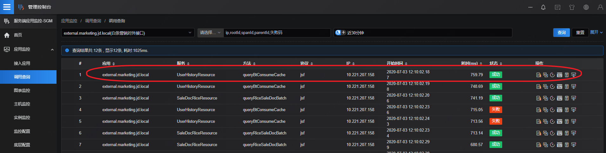
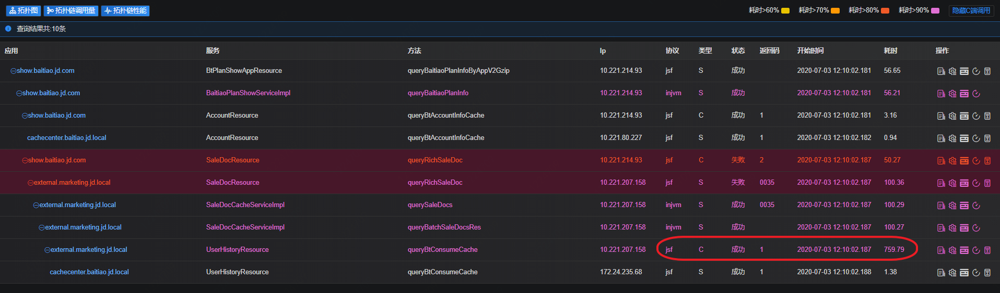
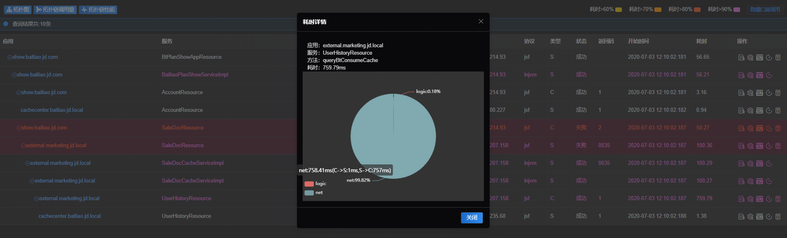
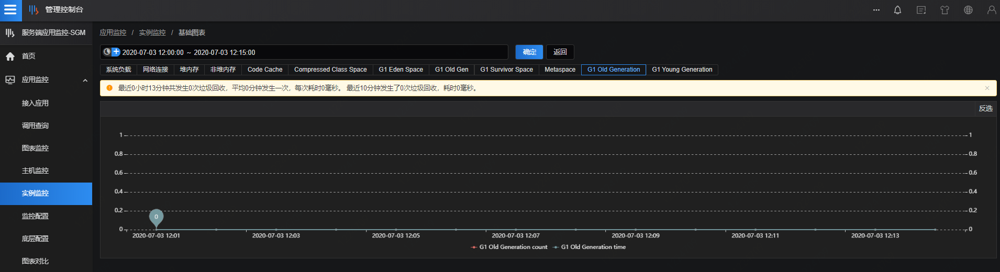
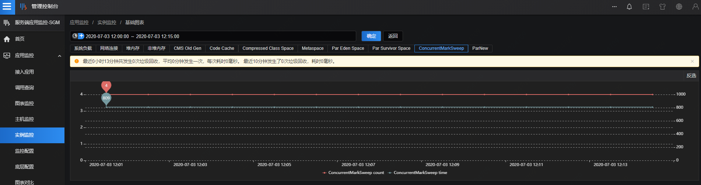

# 场景二：定位远程调用过程中客户端和服务端性能不一致

例如：在生产环境调用某jsf接口时，发现jsf的客户端方法调用服务端方法并收到响应的这个过程耗时较长，期望找到中间存在问题的环节。

解决方案

建议jsf的客户端和服务端应用都接入SGM，在发生调用后，会收到SGM告警，告警提示某应用的jsf客户端方法耗时高。

1. 登录sgm系统，按照告警中显示的应用服务方法名及发生时间，在调用查询中找到相应的调用记录。

2）查看该条调用记录的调用链，由于告警中提到的是jsf的客户端方法，所以在查看调用链的时候需要点击"显示C端调用"。在调用链中可以看到告警中提到的jsf客户端方法queryBtConsumeCache耗时759.79ms，相应的服务端方法耗时非常小。

查看耗时明细饼图，显示客户端的耗时中net耗时占据99%以上

3）考虑到jsf客户端服务端耗时高可能原因：

- 客户端发出请求之后GC了
- 服务端收到请求之前GC了
- 服务端线程处理不过来了
- net延时，跨机房网络问题，丢包问题等

现在逐一排查这些问题，首先看客户端方法所在应用的GC情况，在实例监控中按照上图中的应用名、IP、开始时间来查询

如上图所示，客户端在告警事件发生的时间并未发生GC，同样的方法继续查看服务端应用的JVM监控。

如上图服务端也未发生GC那么久可以确定是网络造成了请求超时，可以直接找网络人员确认。

