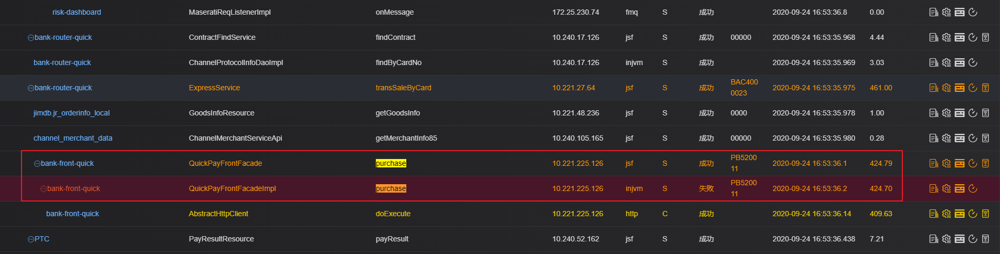

# 场景三：业务系统根据某业务字段跟踪全链路调用

例如：应用有一个支付接口，接口的入参为“订单号”，该接口存在性能问题，期望通过SGM汇聚涉及该订单号的所有调用记录，定位性能异常问题。

解决方案：

接入SGM，在监控配置中，配置该支付接口的“订单号”入参为业务字段，一旦该接口被调用，SGM将采集这个业务字段值，并在调用查询中得以体现。

找到这个订单号0924654423793310的调用记录后，可通过点击“调用链”在SGM的调用链拓扑图中查看与该笔交易相关的整个调用链路。在调用链中也可关联进行耗时明细、性能图表监控，可参考场景一。

现在可以看到这个接口返回了失败，SGM会展示失败返回码及失败描述信息。
