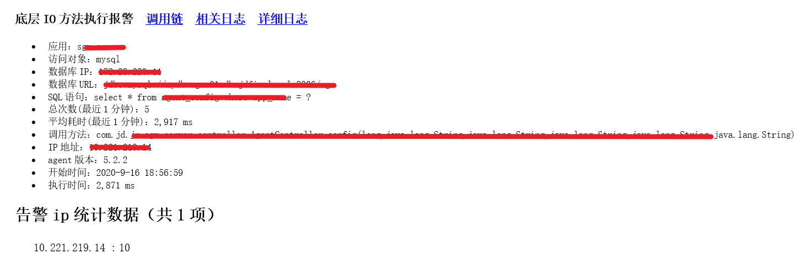
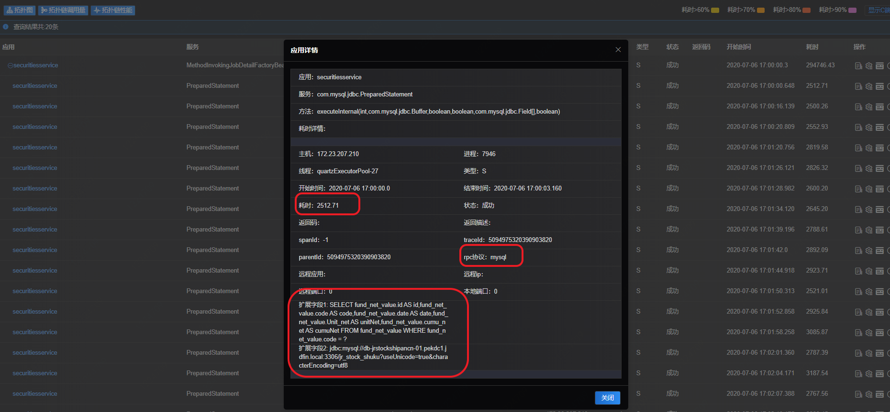

# 场景四：底层接口比如数据库、缓存等性能异常定位

例如：某业务代码中，包含多处数据库的调用，但是经常有调用数据库慢的情况发生，期望在调用过程中查看具体的慢SQL。

解决方案：

应用接入SGM，查库慢发生的时候，会收到SGM告警，告警提示有慢SQL。

通过告警邮件中的“调用链”链接直接跳转或者在SGM中输入告警中的查询条件在调用查询中找到相应记录，点击调用链，找到对应的调用详情。

