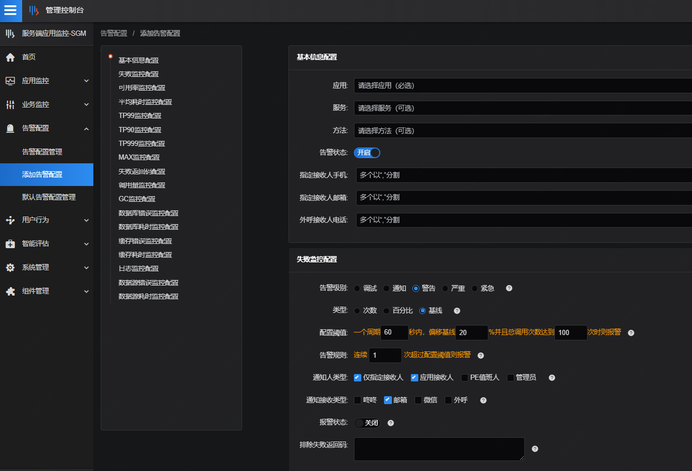

# 场景八：海量接口的告警配置方案

例如：应用有海量方法需要告警，但单独配置工作量较大，为此，SGM研发出基线告警的概念，取过去一段时间的平均值作为告警参考来解决告警配置问题。

解决方案：

应用接入SGM，运行一段时间后，进行基线告警配置。

以成功率为例，配置失败监控告警，并按“基线”类型配置，基线是SGM计算的某个监控指标过去一段时间的平均值，在告警配置中，可配置一个周期60秒内，偏移基线20%并且总调用次数达到100次时则报警，假设基线是100%，则当60s内，调用量达到100，并且成功率降低到80%以下，SGM就会发出告警。

