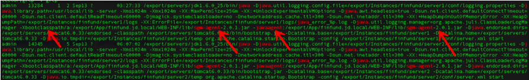

# 常见问题

**Q：应用性能监控如何接入？**

A：无需修改代码即可快速接入，具体接入步骤参考接入手册。

**Q：监控数据保留多久？**

A：正式上线时可以按租户、应用维度去修改保存时长（套餐），支持1、3、7、14、30天。

**Q：接入后如何验证接入成功了？**

A：首先，通过ps命令查看进程，确认进程里已经加上了启动参数：

其次，登陆SGM管理端页面，进入我的应用，输入应用名，如果节点数已经产生，说明接入成功。同时在监控数中对应部署agent的数量。

最后在业务产生调用后，可以在日志搜索中输入对应的应用名、服务名、方法名、IP等进行查询，均可找到调用日志。

**Q：接入成功后为什么控制台上没有监控数据？**

A：请确认以下两点：

1、您的应用是否发送调用请求，同时确认开发框架是否在SGM支持范围内。

2、您搜索的时间和应用是否正确。

**Q：** **接入后如何停止服务？**

A：

tomcat

\1. 删除在{TOMCAT_HOME}/bin/setenv.sh中SGM的脚本。

\2. 重启您的应用。

SpringBoot

\1. 删除启动脚本start.sh中SGM的脚本。

\2. 删除启动命令中的$SGM_OPTS。

\3. 重启您的应用。

**Q：如何升级agent？**

A：根据产品的agent升级后自动升级，无需关注

**Q:SGM和其他APM产品是否兼容？**

A：SGM的agent与其他APM产品agent不兼容，可能会产生代码冲突并造成性能问题，强烈建议您不要同时安装多个APM Agent。

**Q：应用性能监控支持什么语言？**

目前应用性能监控已经支持 Java，其他主流语言之后会陆续支持。

**Q：应用性能监控支持什么框架？**

A：

RPC类：包括Dubbo、gRPC、Hessian、Motan、JSF、基于Netty的RPC框架。

Servlet容器类：Tomcat、Jetty

MVC类：SpringMVC、Struts、WS、REST、hundsun MVC（恒生电子）

http类：HttpClient、Feign

工具类：Confluence、Jenkins

日志类：Logback、log4j

MQ类：JMS、FMQ、ActiveMQ、Kafka、RocketMQ、JMQ

调度类：ElasticJob、Quartz、Saturn、Tbschedule

数据库：bonecp,c3p0,dbcp,druid,hikari,jdbc, Cassandra,mongo,redis,memcache

jdk：- JDK 1.6.0+

\- JDK 1.7.0+

\- JDK 1.8.0_60+ 注意：建议使用1.8.X最新版本，最后一个免费版本为1.8.0_202。

\- JDK 11.0.0+

**Q：分布式链路追踪的原理是什么？**

A：为每一次请求生成一个 TraceID 并且透传整个调用过程，通过 TraceID 即可串联整个调用链。

**Q：探针是否会侵入业务代码？**

A：应用性能观测探针不侵入业务代码，您需要安装 Agent 或者引入对应插件，即可开始监控您的服务。

**Q：应用性能监控的 agent 是否可以监控容器应用?**

A：可以，物理机、虚机、容器应用都兼容。

**Q：应用添加了SGM后，为什么启动报错了？**

A：	可能的原因：

1）启动报错sgm域名连接异常，一般为测试环境DNS问题，请联系客服。

2） 启动报java.lang.NoSuchMethodError: org.apache.log4j.Logger.isTraceEnabled()Z异常，请升级log4j版本至1.2.17；

**Q：方法执行成功了，但为什么SGM控制台显示方法调用失败？**

A：请先确定您的方法返回码，即哪个字段表示成功或者失败，如果您的返回码是原始数据类型（int，string等）是我们定义的默认返回码字段中的一个（responseCode, retCode, errorCode, resultCode, code, CODE），此处无需配置。默认0或多个0、true，TRUE，success，SUCCESS等表示成功。如您判断成败的标准与系统默认返回码不符，需要手动配置成功/失败返回码。但也建议您再定义方法时使用常规返回码定义。

**Q：如何修改成功/失败返回码配置？**

A：	修改该配置有两种途径：

1）如果需要修改返回码请在使用帮助的监控方法配置中查看配置方式；

2）如果您不想收到告警但依旧统计成功和失败。在收到的告警邮件中，点击相关链接：

需要修改返回码可能基于两种原因：

- 方法代码有所变动，常规修改返回码的值；

- 方法实际返回成功，但系统却发送了方法失败的告警邮件，这是因为该成功返回码不在系统预设的默认成功返回码列表中，这样系统会认为该方法失败了。

出现第一种情况时可以直接点击邮件中的“修改监控配置”，跳转到SGM相应的监控配置页修改；

出第二种情况时，可以参考第一种情况修改，也可以点击“排除此码”来进行配置，设置完成之后，系统不会再发送此返回码的告警邮件。

**Q：某个方法实际耗时确实比较长，但我不想收到这样的告警怎么办？**

A：如果某一个应用的方法本身需要的耗时确实会比较长，以至于超过了系统预设的全局默认告警配置，但是运维人员或应用开发人员不希望收到这样的耗时告警，这时需要单独为这个方法添加一个告警配置，这样系统会优先匹配此配置，超时报警将不再发送。