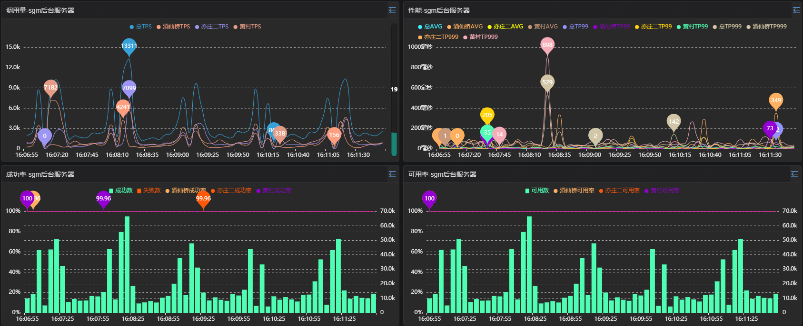
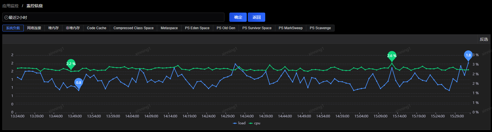
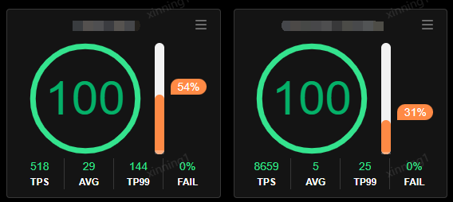
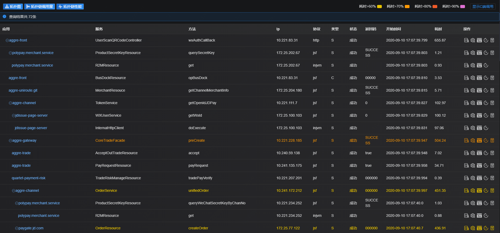
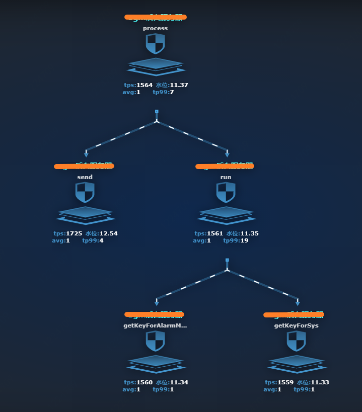
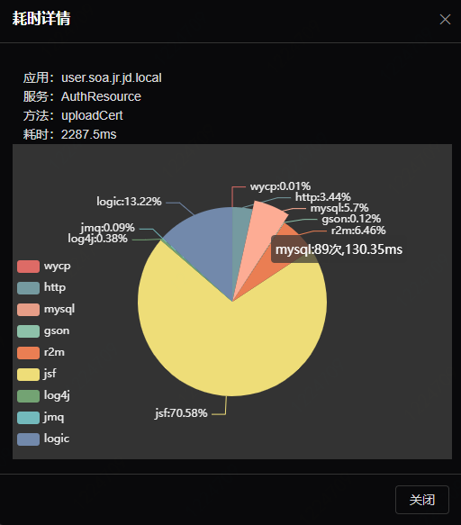

# 应用场景

## 应用、服务、方法调用量、性能、成功率、可用率等基础监控与预警

调用量、性能、成功率和可用率是SGM作为业务监控系统所需要满足的最基本、最核心的功能。调用量监控指标为TPS，性能指标包括AVG、TP99、TP90、TP50等，性能监控指标主要针对失败率进行的，可用率是反映应用程序本身异常的指标。

通过选定应用、服务、方法及监控时间区间，SGM会展示所选条件下的TPS、AVG、成功率、可用率等曲线。

- TPS：应用每秒钟处理的请求数。

- AVG：应用对每个请求响应的平均时间。

- TP99：99%的请求的响应时间小于或等于该值。

- TP90：90%的请求的响应时间小于或等于该值。

- TP50：50%的请求的响应时间小于或等于该值。

- 失败率：应用对请求响应的成功、失败比率。

- 可用率：应用对请求响应的成功、异常比率。这里的异常指的应用程序本身抛出的异常，不包括方法本身返回失败码的情况。通过这种筛选，能更精确定位出程序本身有异常问题的
如果应用配置了可用率的告警，也大大降低告警的误报率。

## JVM各种指标的监控与预警

JVM（JavaVirtualMachine，Java虚拟机）是JRE（JavaRuntimeEnvironment，Java运行环境）的一部分。它是一个虚构出来的计算机，是通过在实际的计算机上仿真模拟各种计算机功能来实现的。JVM有自己完善的硬件架构，如处理器、堆栈、寄存器等，还具有相应的指令系统。Java语言最重要的特点就是跨平台运行。使用JVM就是为了支持与操作系统无关，实现跨平台。

SGM提供对于监控JVM运行状态的实时监控，可通过图表展示JVM内存分配情况、内存使用情况、垃圾收集信息等内容。并可根据配置的JVM告警策略，在GC频繁发生的情况下通知相关人员。

## 动态容量规划，实时显示应用容量水位

现有技术评估容量都局限于人为压测评估或者静态评估，SGM取代了人为压测评估方式，通过程序智能计算应用容量，将静态的容量评估变成动态的容量评估，使实时的容量评估和弹性伸缩成为可能。

SGM通过获取到的方法耗时明细，结合连接数、线程池等指标，得出应用的单机容量，在此基础上再叠加CPU、磁盘、网络带宽等指标来最终得到系统的单机容量。

水位即单台机器当前调用量占容量的比重，这个值会实时刷新显示当前水位。

## 调用链追踪

调用链是一次请求所经过的所有系统的集合产生的链条，反馈了系统间的依赖关系及时序，是分布式服务跟踪的关键所在。

调用链是由调用的源头系统产生一个全局唯一的ID (“RootID”)，每个调用节点产生一个自身的节点ID (“NodeID”)，通过应用层协议将两个唯一的ID透传到各服务节点，每个节点产生一条调用日志，最终由服务端通过这些调用日志还原系统行为的过程。

目前SGM支持的应用层协议包括HTTP（Servlet、 Netty HTTP Decoder、 Apache HttpClient、JDK HttpURLConnection）、JMS（ActiveMQ、）、AMQP（RabbitMQ）、DUBBO（阿里巴巴开源RPC协议）、JSF（京东内部RPC协议）、JDBC（MySQL、Oracle、SQLServer）、Redis等等。见如下案例图。

针对调用链拓扑也可同时查看拓扑图上各节点的实时监控数据，包含TPS、AVG、水位、底层监控（mysql、logback等）耗时等信息。

## 方法耗时分布

如下图所示，每一个服务端方法的调用都可以查看其耗时详情，这个在定位方法性能问题时有着尤为重要的作用。无需再借助其他繁琐的第三方工具，在查看调用链的同时，方法耗时详情也一目了然，耗时的分块包括逻辑、数据库、调用接口等。

