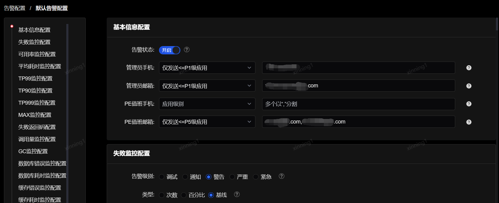

# 默认告警配置

此菜单是只对管理员开放，用于配置系统的全局默认告警，该告警对所有应用均有效。

和普通的应用告警配置类似，全局默认告警也可以修改告警状态。全局的默认告警接收人可根据应用等级来指定配置。如上图所示，表示只有应用等级<=P1级的应用才会给管理员的手机、邮箱和PE值班手机发送告警，应用等级<=P5级的应用则只给PE值班邮箱发送告警。

全局默认告警配置包括失败监控配置、平均耗时监控配置、TP99监控配置、TP90监控配置、TP999监控配、MAX监控配置、失败返回码配置、调用量监控配置、GC监控配置、数据库错误监控配置、数据库耗时监控配置、缓存错误监控配置、缓存耗时监控配置、日志监控配置、数据源错误监控配置、数据源耗时监控配置。每个配置的配置方式和各字段含义也与普通应用告警配置相同。

如果某应用的方法本身需要的耗时确实比较长，以至于超过了预设的全局默认告警配置，但是运维团队不希望收到此类耗时告警，这时可以单独为这个方法添加一个告警配置，系统将优先匹配该单独配置。