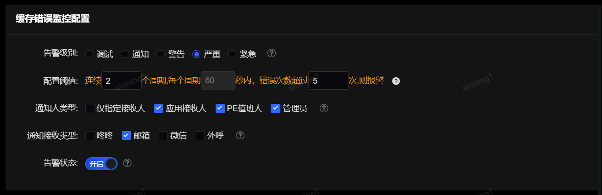

# 方法告警配置
SGM提供针对应用、服务、方法的性能报警、失败率报警、返回码报警、调用量报警、JVM报警、数据库、缓存等底层监控报警的多种报警类型。

## 1. 方法告警配置

可以通过应用、服务或者方法的关键词对告警配置进行搜索，并在搜索结果页面对其修改或者删除。


 
告警状态分为启动和停用两种。启动时，系统将向配置的告警接收人和全局默认告警接收人发出告警（邮件、短信等）。

## 2. 添加告警配置

在上图中点击“添加告警”进入详细的告警配置页面。

### 基本信息配置
 


基本信息配置属于全局性设置，应用、服务、方法中，应用为必选项。在不设置方法的情况下，该应用的方法的告警策略将遵循应用的告警策略。

告警的配置项分为方法级告警配置和应用级告警配置。如果基本信息配置中设定了应用、服务、方法，则下方只能配置方法级告警配置项，应用级告警配置项将被隐藏。如果基本信息配置中只选择了应用，没有指定服务和方法，则下方能够同时配置方法级告警配置项和应用级告警配置项。

告警配置的详细分类如下所示：

<table width=60%>
<tr>
    <th width=30%>类型</th>
    <th witdh=70%>告警配置项</th>
</tr>
<tr>
    <td rowspan=9>方法级告警配置项</td>
    <td>失败监控配置</td>
 </tr>
 <tr>
     <td>可用率监控配置</td>
 </tr>
 <tr>
     <td>平均耗时监控配置</td>
 </tr>
  <tr>
     <td>TP90监控配置</td>
 </tr>
  <tr>
     <td>TP99监控配置</td>
 </tr>
  <tr>
     <td>TP999监控配置</td>
 </tr>
  <tr>
     <td>MAX监控配置</td>
 </tr>
  <tr>
     <td>失败返回码监控配置</td>
 </tr>
  <tr>
     <td>调用量监控配置</td>
 </tr>
<tr>
    <td rowspan=8>应用及告警配置</td>
    <td>GC监控配置</td>
</tr>
<tr>
    <td>数据库错误监控配置</td>
</tr>
<tr>
    <td>数据库耗时监控配置</td>
</tr>
<tr>
    <td>缓存错误监控配置</td>
</tr>
<tr>
    <td>缓存耗时监控配置</td>
</tr>
<tr>
    <td>日志监控配置</td>
</tr>
<tr>
    <td>数据源错误监控配置</td>
</tr>
<tr>
    <td>数据源耗时监控配置</td>
</tr>
</table>

基本信息配置的报警状态开关将影响整个应用的告警状态，即，如果状态选择关闭，则后续所配置的失败监控配置、平均耗时监控配置等告警状态也都是关闭。如果需要单独对失败监控进行告警，可以将基本告警配置中的告警状态设置为开启，而将其他告警配置（失败监控配置除外）中的告警状态均置为关闭。

指定通知人手机/邮箱是当需要指定除默认应用负责人/联系人以外的人员时使用。填写后，该手机和邮箱也将收到此应用的告警。应用的负责人和联系人将默认收到告警，无需在此重复填写。

### 失败监控配置
 


- 告警级别：告警发送的级别；

- 类型：失败次数、失败百分比、基线。类型的选择会影响下方的配置阈值的填写方式；

- 配置阈值：在设定的周期时间内，失败次数超出指定次数，或失败比例超过指定比例，或失败偏移基线达到指定百分比，并且总的调用次数达到某一个设定值时，触发报警（是否触发需结合下方“告警规则”配置）；

- 告警规则：假如配置的周期为60秒，选择连续两次超过阈值，则需要连续的两分钟都达到告警条件才会触发报警，该参数的目的是为解决毛刺问题；

- 通知人类型：选择通知人。

    仅信息指定人：告警仅发送给指定接收人，一般在调试阶段使用；

    应用接收人：目前版本为当前租户下所有的用户；

- 通知接收类型：报警以短信、邮件、微信或者外呼的方式发送通知，可多选；

- 告警状态：告警开关，关闭后这个规则将不再触发报警；

- 排除失败返回码：在计算失败数、失败率告警时，会忽略此失败返回码的失败数。

正则示例：

```
“.*BA.*”:包含BA的任意字符串
“^((?!BA).)*$”:不包含BA的任意字符串
“^BA.*”:以BA开头的任意字符串
“.*BA$”:以BA结尾的任意字符串
多个表达式通过“;”隔开：AB0001;.*SUCCESS.*;*BA$
```

### 可用率监控配置
 


- 告警级别：告警发送的级别；

- 类型：不可用次数、不可用百分比、基线。类型的选择会影响下方的配置阈值的填写方式；

- 配置阈值：在设定的周期时间内，不可用次数超出指定次数，或不可用比例超过指定比例，或不可用偏移基线达到指定百分比，并且总的调用次数达到某一个设定值时，触发报警（是否触发需结合下方“告警规则”配置）；

- 报警规则：同之前描述；

- 通知人类型：同之前描述；

- 通知接收类型：同之前描述；

- 报警状态：同之前描述。

### 平均耗时监控配置
 


- 告警级别：告警发送的级别；

- 类型：按照耗时或基线配置；

- 配置阈值：每个周期规定时间内，平均耗时超过设定阈值，或偏移基线百分比超过设定阈值，并且总的调用次数达到某一个设定值时报警；

- 告警规则、通知人类型、通知接收类型、报警状态等配置同之前描述。


### TP99监控配置
 


- 告警级别：告警发送的级别；

- 配置阈值：每个周期规定时间内，TP99耗时超设定阈值，并且总的调用次数达到某一个设定值时报警；

- 告警规则、通知人类型、通知接收类型、报警状态等配置同之前描述。

### TP90监控配置
 


- 告警级别：告警发送的级别；

- 配置阈值：每个周期规定时间内，TP90耗时超过设定阈值，并且总的调用次数达到某一个设定值时报警；

- 告警规则、通知人类型、通知接收类型、报警状态等配置同之前描述。

### TP999监控配置
 


- 告警级别：告警发送的级别；

- 配置阈值：每个周期规定时间内，TP999耗时超过设定阈值，并且总的调用次数达到某一个设定值时报警；

- 告警规则、通知人类型、通知接收类型、报警状态等配置同之前描述。

### MAX监控配置
 


- 告警级别：告警发送的级别；

- 配置阈值：每个周期规定时间内，最长耗时超过设定阈值，并且总的调用次数达到某一个设定值时报警；

- 告警规则、通知人类型、通知接收类型、报警状态等配置同之前描述。

### 失败返回码配置

 

- 告警级别：告警发送的级别；

- 失败返回码：对某返回码出现次数进行告警配置。多个返回码用“;”分割，支持正则，点击“添加”按钮添加到下方失败返回码列表；

- 配置阈值：每个周期规定时间内，指定失败返回码出现的次数超过设定阈值，并且总的调用次数达到某一个设定值时报警；

- 告警规则、通知人类型、通知接收类型、报警状态等配置同之前描述。


### 调用量监控配置
 


- 告警级别：告警发送的级别；

- 类型：包括次数、基线和同比三种类型，下方配置阈值时会依据类型变化而不同；

- 配置阈值：调用量超过指定阈值，或调用量偏移基线百分比超过设定阈值，或调用量偏移同比百分比超过设定阈值，且总调用次数达到指定量级时出发报警。当按照同比进行配置时，同时可设定同比周期，默认同比周期为1天，即代表与1天前的相同时段的数据进行对比；

- 告警规则、通知人类型、通知接收类型、报警状态等配置同之前描述。

### GC监控配置
 


- 告警级别：告警发送的级别；

- 配置阈值：连续多少个周期，每个周期规定时间内发生full GC次数超过设定阈值时，触发报警；

- 通知人类型、通知接收类型、报警状态等配置同之前描述。

### 数据库错误监控配置
 


- 告警级别：告警发送的级别；

- 配置阈值：连续多少个周期，每个周期规定时间内，数据库错误次数超过设定阈值时，触发报警；

- 通知人类型、通知接收类型、报警状态等配置同之前描述。

### 数据库耗时监控配置
 


- 告警级别：告警发送的级别；

- 配置阈值：连续多少个周期，每个周期规定时间内，数据库耗时次数超过设定阈值时，触发报警。数据库耗时的阈值，会读取“应用监控->底层监控配置”中设定的所有数据库相关项的告警阈值，因此也可以到底层监控配置页面中对数据库耗时告警阈值进行调整。例如，底层监控配置中，设定该应用的mysql告警阈值2500ms，oracle告警阈值2000ms，则这里会分别统计每个周期规定时间内mysql超过2500ms的次数，oracle超过2000ms的次数，如果均超过设定阈值，则会分别触发告警；

- 通知人类型、通知接收类型、报警状态等配置同之前描述。

### 缓存错误监控配置
 


- 告警级别：告警发送的级别；

- 配置阈值：连续多少个周期，每个周期规定时间内，缓存错误次数超过设定阈值时，触发报警；

- 通知人类型、通知接收类型、报警状态等配置同之前描述。


### 缓存耗时监控配置
 


- 告警级别：告警发送的级别；

- 配置阈值：连续多少个周期，每个周期规定时间内，缓存耗时超时的次数超过设定阈值时，触发报警。这里的缓存耗时阈值，会读取“应用监控-底层监控配置”中所有缓存相关项的告警阈值，因此也可以到底层监控配置中对缓存相关项的告警阈值进行调整；

- 通知人类型、通知接收类型、报警状态等配置同之前描述。

### 日志监控配置
 


- 告警级别：告警发送的级别；

- 配置阈值：连续多少个周期，每个周期规定时间内，日志超时的次数超过设定阈值时，触发报警。这里的日志耗时阈值，会读取“应用监控-底层监控配置”中所有日志相关项的告警阈值，因此也可以到底层监控配置中对日志相关项的告警阈值进行调整；

- 通知人类型、通知接收类型、报警状态等配置同之前描述。

### 数据源错误监控配置
 


- 告警级别：告警发送的级别；

- 配置阈值：连续多少个周期，每个周期规定时间内，数据源错误次数超过设定阈值时，触发报警；

- 通知人类型、通知接收类型、报警状态等配置同之前描述。

### 数据源耗时监控配置
 


- 告警级别：告警发送的级别；

- 配置阈值：连续多少个周期，每个周期规定时间内，数据源耗时超时的次数超过设定阈值时，触发报警；

- 通知人类型、通知接收类型、报警状态等配置同之前描述。
