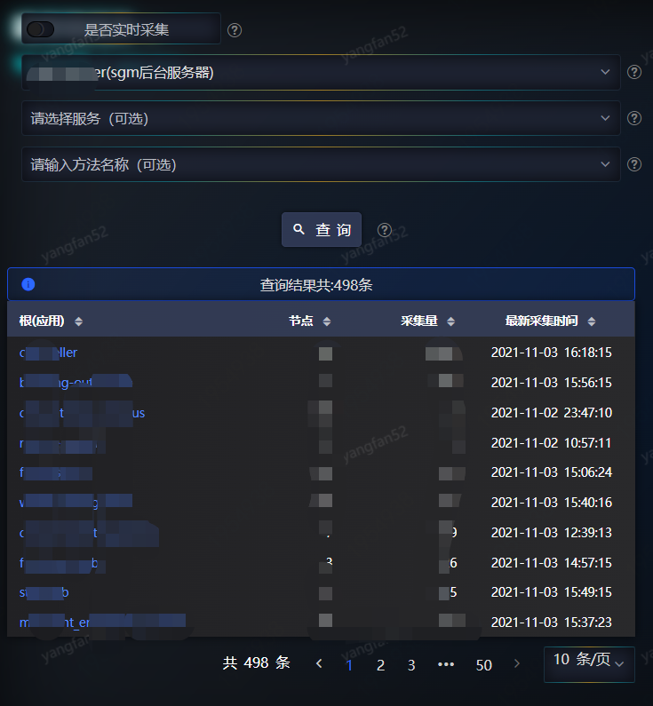
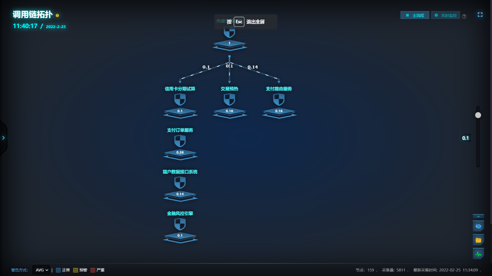
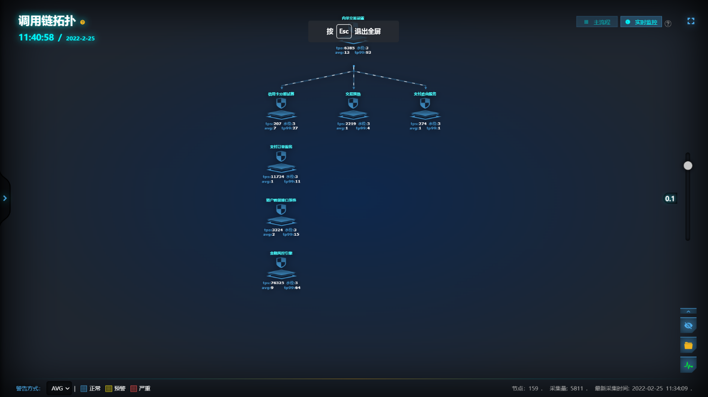

# 调用拓扑

如果需要查看某个应用/方法和其他一个或多个应用在同一条调用链中的相对位置，可以通过调用拓扑图表实现。

首先选择需要查看的应用/方法。如果是非实时采集，只有应用是必选项，否则，应用和方法都是必选项。点击“查询”后，会搜索出与该应用/方法有直接或间接调用关系的应用。注意，这些应用都是调用链中的根应用，也就是说，稍后要绘制出的拓扑图表是以它们为根节点，并且经过在查询条件中选中的应用/方法。点击需要查看的根节点，可查看以该节点为根，且经过了所选中应用的调用拓扑图。

上图是隐藏了异步调用的调用链拓扑图，各节点之间的调用关系及调用次数一目了然。调用链以上文勾选的根应用为根节点，节点之间连线上的数字表示的是调用次数的比例，是先将根节点的调用次数作为基数1，然后再计算出根节点以下每个节点的调用次数。即，根节点每调用一次，下游节点各调用多少次。主流程图就是根据这个调用次数（默认调用次数比例>0.2）过滤出的主要流程节点。

右下角提供三个功能按钮，从上到下依次为：“显示/隐藏异步调用”、“页面收藏”、“监控图表”：

**1****、“显示/隐藏异步调用”**

点击后切换拓扑图中节点是否显示异步调用节点。

**2****、“页面收藏”**

点击后弹出图表收藏配置弹窗，提交后可在收藏中快速查看。收藏配置如下：

收藏配置中的收藏名称为必须填项，可通过选择“授权类型”限定本收藏拓扑图的可见用户范围，包括仅自己可见和所有人可见。

l 仅自己可见：需要填写可见人。只有“可见人”用户可见，并显示在收藏的“个人定制”中；

l 所有人可见：所有用户登录系统后都可以查看，显示在“公共定制”下。

**3****、“监控图表”**

点击则调转到“性能监控图表”中。

点击“实时监控”后，显示各节点实时的TPS、AVG、TP99等指标，如下所示：

该页面上显示的TPS、AVG、TP99也会实时发生变化，如果在左下角选择了AVG，则当各节点的AVG超过其告警阈值时，节点的颜色会发生变化，提醒注意。同理，切换到TP99，节点的颜色也会随相应的告警阈值发生变化。