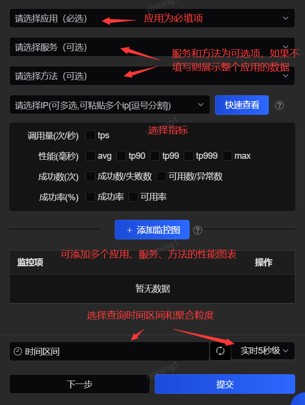
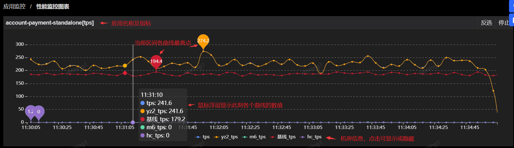
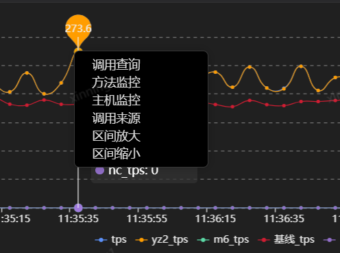
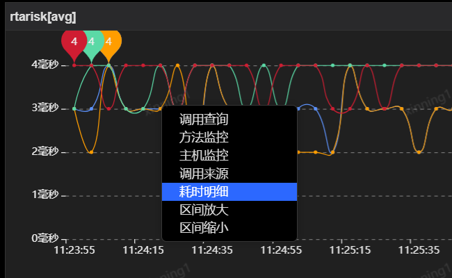
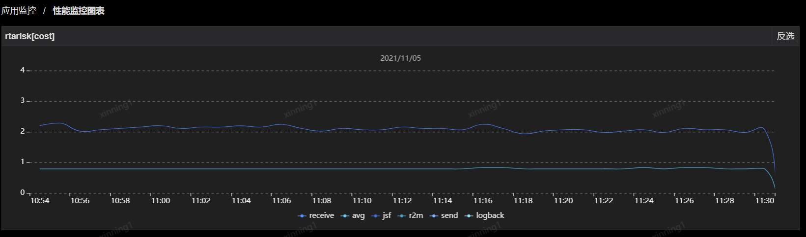
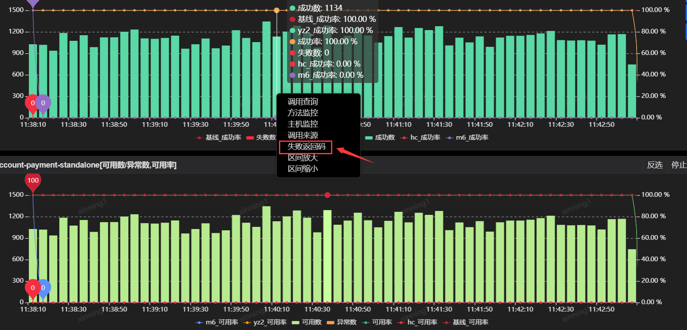
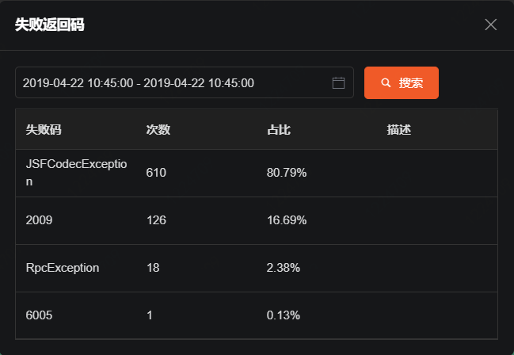
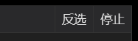

# 性能监控图表

除了在首页“我的应用”中能查看到用户的所有应用，也可以通过精确搜索定位到一个或多个应用的监控数据。在菜单栏选择“性能监控图标”，系统右侧展示如下筛选查询选项：

 
上图中查询条件分为两个区域：应用信息和时间区间。应用信息可通过逐层（应用-服务-方法-IP）选择来确定。

如果进入时不选择时间区间，默认显示5秒粒度的实时数据。在下一次变换时间区间之前，监控曲线会持续实时更新。

时间区间提供最近3分钟、最近15分钟、最近30分钟、最近3小时、最近12小时、最近1天、最近1周、最近1月、最近半年等多个区间，时间粒度包括1秒、5秒、10秒、1分钟、5分钟、1小时、1天等多种粒度，也支持手动输入当天的某一时间段。也可以根据屏幕大小切换监控曲线图的显示样式，比如1*2，即每横排显示两幅图的含义。

应用信息部分只有应用名称/id是必填项，其他都可根据需要进行选择，选择完成应用的信息之后，点击“+添加监控图”按钮，则性能监控图标将自动添加绘制。如果需要同时查看其他应用的曲线，继续选择，然后再次点击“+添加监控图”即可添加多张图表。最后点击提交确认，该窗口会自动收回，并展示刚才所定制的监控曲线图表。以具体应用为例，下图是按应用定制的TPS监控曲线图：
 

图中每个时刻都可点击弹出下钻分析菜单，包括下钻查询此时刻的方法调用、方法监控、主机监控、调用来源，以及对该区间图形进行放大或缩小。

 
- 调用查询：点击后会跳转到“方法调用查询”页面，同时筛选了当前的应用、服务、方法、时间区间。

- 方法监控：点击后会跳转到“方法性能分布”页面，同时筛选了应用、时间区间。

- 调用来源：调用来源查看的是调用了这个应用/服务/方法的应用（前提是该应用已接入了SGM），如果从TPS图表进入的，则查看的是调用来源应用的调用TPS，如果是从AVG图表进入，则查看的是调用来源应用的调用AVG，以此同理。

- 区间放大与区间缩小：点击后可对所选区间的时间粒度进行放大或缩小，例如将10秒粒度放大为5秒，或缩小为1分钟。

在avg指标的图表中，点击某个时刻弹出的下钻菜单，增加了项耗时明细的选项功能。

 
点击后，会在新窗口中展示所选时刻应用/服务/方法的耗时分布的趋势，如JSF耗时趋势、R2M耗时趋势等（JSF是一种RPC框架，R2M可以是增强型redis），如下图所示：

 
如果是成功、失败或可用性相关的图表，还可下钻查看失败返回码分布数据，如下图所示：（返回码查看仅限于实时1秒、5秒、10秒和1分钟）

 
图形的右上角还有两个操作按钮，分别是反选和停止。

 
- 反选：点击后可反选当前图表上显示、隐藏的图形。

- 停止：点击后可停止当前图表的自动刷新，同时该按钮变为“刷新”。再次点击“刷新”按钮后，图表会继续自动刷新。
