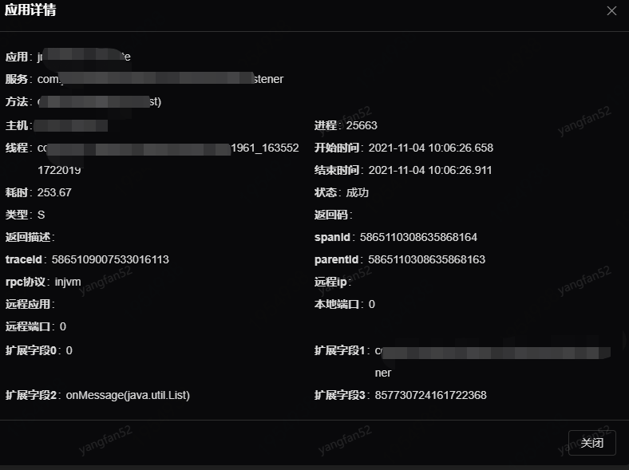
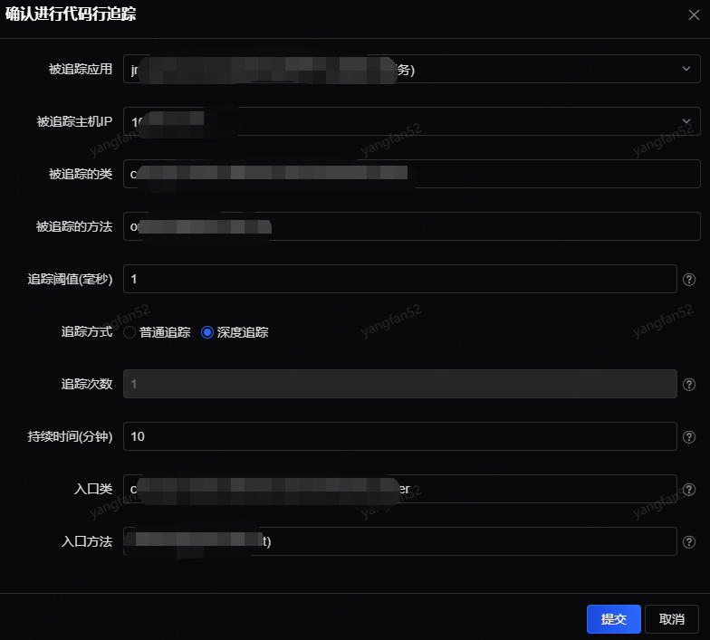
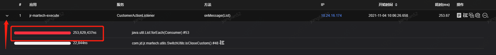
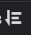

# 代码执行效率

在应用中选择需要查询的应用和查询时间范围，类名、方法和追踪ID为非必填项。在调用列表中点击列表前的下拉按钮可展示追踪基本信息，包括被追踪应用、服务、方法、IP、阈值、次数、持续时间、ID和入口方法。每次追踪结果可执行“详情”、“追踪代码行耗时”、“全调用链”、“方法监控配置”等几个操作。

本文档主要介绍“追踪代码行耗时”的功能。

1. 详情

点击详情展示本次调用的详情如下：

包括本次调用的应用、服务、方法、IP、起始时间、进程、耗时、状态、类型（C端/S端）以及调用链路的ID等信息：

 

2. 追踪代码行耗时
 

追踪阈值：只有方法(函数)执行时间超过这个阈值(毫秒)，才会被执行代码行追踪。

追踪方式：深度追踪实时刷新加载新监控代码行监控数据，展示的是根据调用关系，每一层的代码行监控数据。

追踪次数：最大追踪次数，超过这个次数会自动停止追踪。

持续时间：最大持续追踪时间，单位是分钟，超过这个时间会自动停止追踪。

入口类：如果指定了这个入口类，那么只有被追踪的方法被这个入口类直接或间接调用时，才会对其进行代码行追踪，入口类和方法必须是监控配置中存在的。

入口方法：如果指定了这个入口方法，那么只有被追踪的方法被这个入口方法直接或间接调用时，才会对其进行代码行追踪，入口类和方法必须在监控配置中存在。比如可以指定只对某个特定业务入口方法调用的工具方法进行代码行追踪。

追踪结束后，点击查询列表前的下拉按钮可展示代码行追踪执行效率，高亮展示出影响效率的代码行及代码行的耗时、代码行号等信息。

点击代码行后的按钮可再次配置代码追踪。
