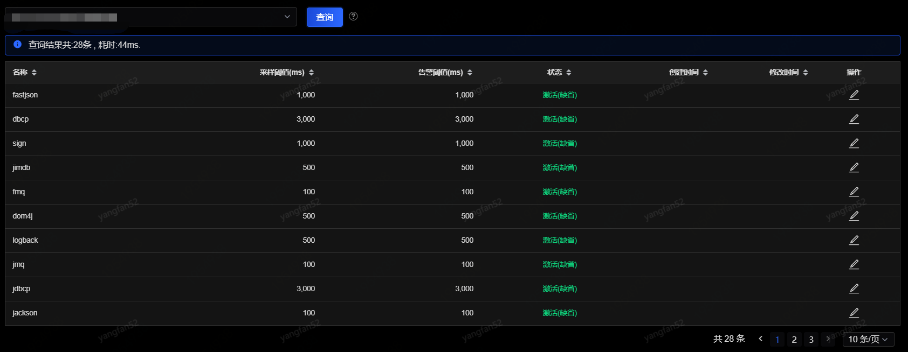
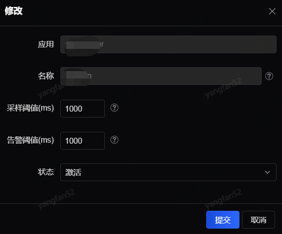
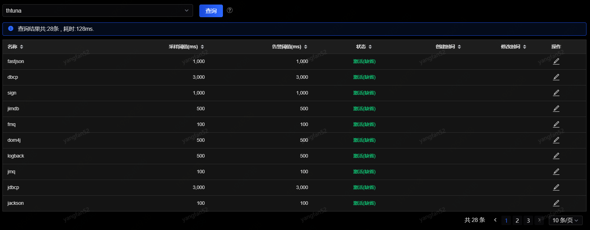

# 底层监控配置

此配置是针对单个应用进行的底层监控配置，如果不单独修改的话，应用将遵循全局的默认配置监控。
 

修改配置页面如下参数：
 

只有监控状态为“启用”，且实际底层方法耗时超过设置的采样阈值时，SGM才会将对这些底层监控日志进行采集，并在“调用查询”中可被查询。

 
从接入列表这里进入的是针对某一个指定应用的底层监控，一般是cache、db等的调用，单独设置采样阈值和启用状态（这里单独设置的采样阈值不能小于全局默认的采样阈值），这样设置完之后，这类型的方法将会与其他普通方法监控区分开来，报警的阈值也会单独处理。“状态”列会有默认缺省状态，使用时根据实际要求修改即可。
