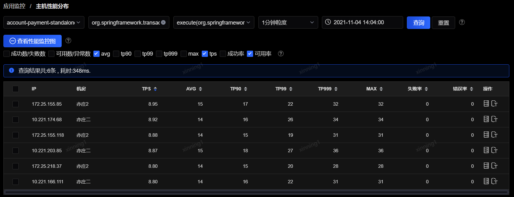

# 主机性能分布

通过在方法性能分布中，点击某个方法操作列中的“主机性能分布”按钮，可以进入该页面（筛选了指定的应用、服务、方法、时间区间）。同时也可以直接通过左侧菜单中的“主机性能分布”链接进入到该页面，手动筛选应用、服务、方法、时间范围等条件查看相应方法在各个主机上的性能分布数据。

 
每一行最后的操作列可查看“jvm监控”。

- jvm监控：点击后会跳转至“进程实例监控”页面，筛选指定的应用和主机IP，详细信息可查看下面单独的进程实例的监控描述。
