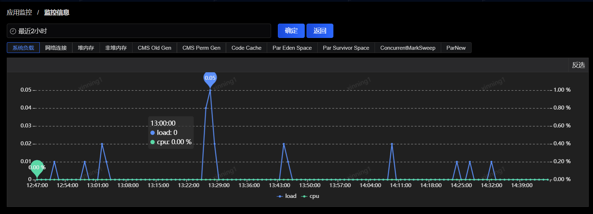

# 进程实例监控

可以在“主机性能分布”中通过点击“jvm监控”按钮，进入到该页面，并自动筛选了对应的主机，也可以通过直接点击左侧菜单中的“进程实例监控”进入到该页面，并手动筛选指定的应用、主机IP、进程号等。

 
进程实例监控展示了对应应用下主机的基础信息和JVM监控信息，主机概要信息包括主机IP、机房、进程、用户、进程实例状态、监控状态、Load、CPU、启动时间、心跳时间、版本号、集群信息。

操作列包含了四个功能按钮，分别是jvm、基础、执行、结果。

点击“jvm”可以查看java虚拟机的监控数据，如下图所示：

 
包括了jvm的系统负载、网络连接、堆内存、非堆内存、GC情况等。

点击“基础”按钮可以跳转至该进程实例的基础信息页面，如下图所示：

 
“执行”和“结果”两个按钮是组合使用的，“执行”按钮可以选择要执行的指令，“结果”按钮可以查看执行的结果数据。

 
“执行”指令包含了启动异常、线程栈、线程栈强制、内存对象、线程分析、cpuinfo。
