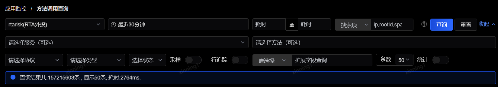
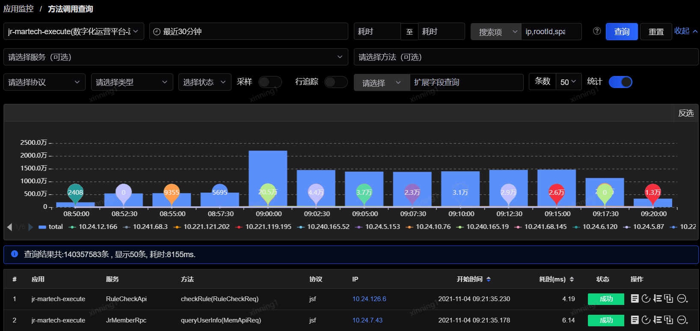
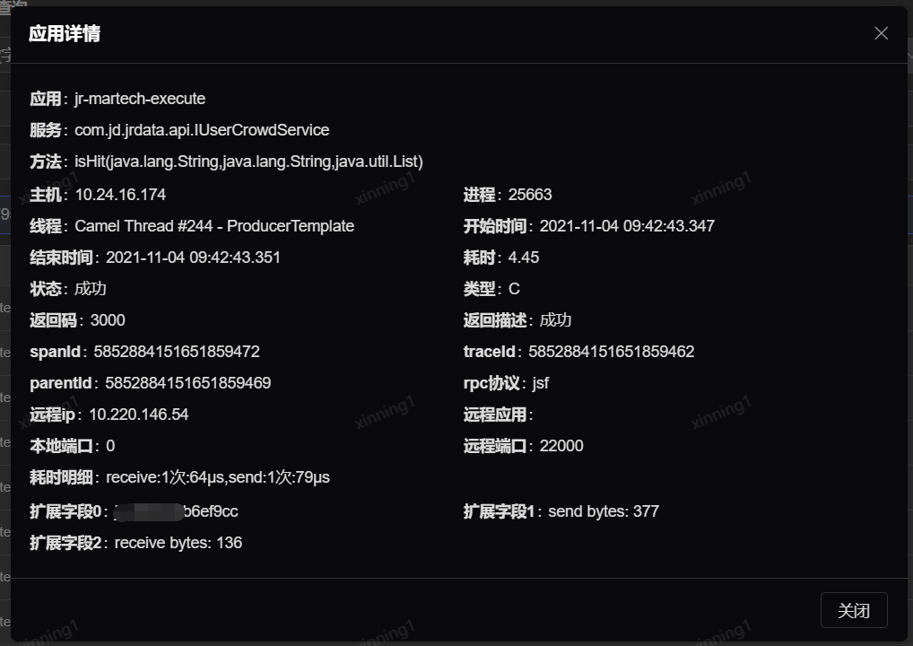
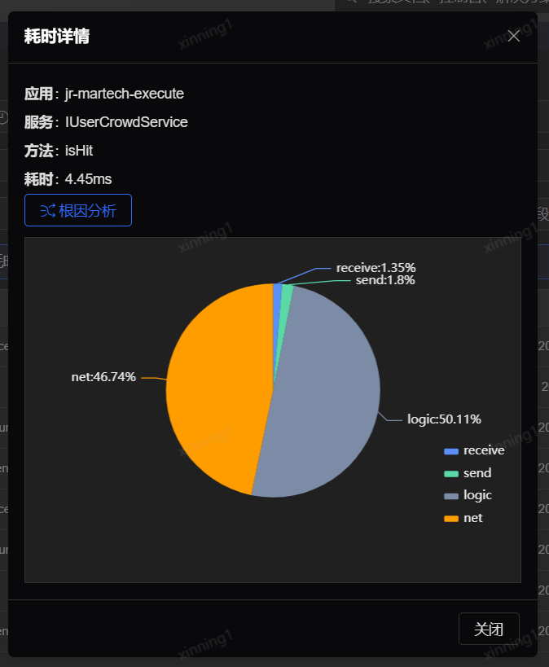
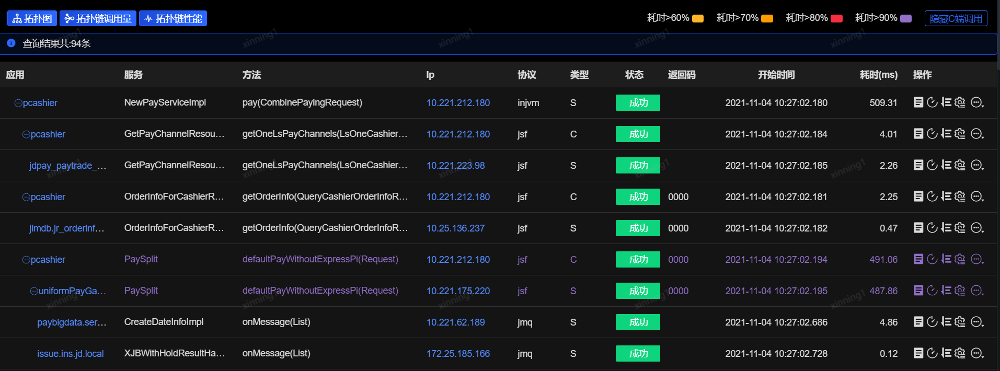
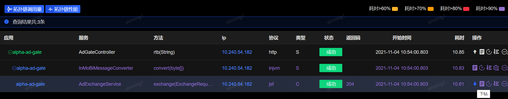

# 方法调用查询

应用接入SGM监控后，被监控的方法在每次被调用时都会产生一条日志，包含应用、服务、方法、协议、主机IP、开始时间、耗时、调用状态（成功/失败）、业务字段（需要在管理界面配置，见监控方法配置）等信息。这条日志会在应用日志中体现，以#sgm-log开头，也可以在管理端设置不打印这条日志，默认情况下不打印。同时，管理端也提供界面查询这一次调用的日志详情。由于日志量可能会比较大，可以按照搜索条件精确定位：

 
- 耗时：该方法本地调用的耗时，这里可筛选耗时区间

- 搜索项：支持搜索IP、traceId、spanId、parentId、失败码

- 协议：支持dubbo、jsf、msp、jmq、http等多种协议

- 类型：该方法在本次调用中的调用类型，包含服务端和客户端

- 状态：该方法在本次调用中的调用结果，包含成功和失败

- 采样：展示周期采样采集到的底层方法监控日志数据

- 行追踪：展示通过提交的追踪代码行耗时采集到的日志列表

- 条数：可查询的日志总数，包含50、100、200，如果所选时间区间日志总数超过所选条数，会按搜索条件的匹配规则显示前50/100/200条

- 扩展字段：支持“模糊查询”和“精准查询”两种搜索方式，“精确查询”只会搜索和所填扩展字段值完全一样的日志记录，“模糊查询”会进行分词搜索。

- 统计：是否查看所选时间区间段内各IP命中的日志数量（柱状图）

调用查询结果页面示例如下：

 
每条日志最后的操作列，默认展示四个分析功能按钮，同时最后的查看更多按钮鼠标悬浮时会显示全部10个分析功能按钮。

全部分析功能按钮包括：详情、耗时详情、追踪代码行耗时、全调用链、下钻调用链、方法监控配置、跳至OMI进行智能根因分析（根因分析为独立模块，需具备监控数据源采集能力）或日志查询、主机监控、网络监控等外部系统（日志查询、主机监控、网络监控等模块等不包含在SGM产品中）。

1. (应用方法）详情

 
点击详情按钮后，可弹出应用详情窗口，展示本地调用日志的详情信息，包括应用名、服务名、方法名、主机IP、进程ID、线程、开始时间、结束时间、耗时、状态、类型、返回码、返回描述、spanId、traceId、parentId、rpc协议、远程IP、远程应用、本地端口、远程端口、耗时明细、扩展字段信息。

其中扩展字段需要在方法配置中进行配置后才会采集。

2. 耗时详情

点击耗时详情按钮，会弹出窗口显示本地调用的详细耗时过程分布信息，例如dubbo、r2m、log、logic等类型的详细耗时和占比，如下图所示：
 
鼠标悬浮在不同的扇区上，浮层会显示该部分的详细耗时数据以及简要说明信息。

如果已经和OMI系统打通，则会显示“根因分析”入口，点击后可跳转至OMI平台的根因分析功能。（根因分析为独立模块，须将各种采集数据对接到OMI）

3. 全调用链

调用链是一次请求所经过的所有系统的集合产生的链条，反映了系统间的依赖关系及时序，是分布式服务跟踪的关键所在。

调用链生成的原理是：由调用的源头系统产生一个全局唯一的ID（“traceId”），每个调用节点产生一个自身的节点ID（“spanId”），通过应用层协议（比如http）将两个唯一的ID透传到各服务节点，每个节点产生一条调用日志，最终由SGM服务端通过这些调用日志还原系统行为的过程。这两个ID在上文中已经提到，会在日志要素详情中查询到，也可以在应用日志的sgm-log行中打印出来，它们也可以作为关键字在日志搜索查询栏中查询一条调用链的完整过程。点击每条日志最后一列的“调用链”按钮，展示页面如下：

 
只要调用链关系树中的节点接入了SGM监控，则所有节点信息（包括异步调用的节点）都会在这个页面中显示。如上图所示，节点所在IP、rpc协议、调用类型、耗时、调用状态等都可以在这里看到，同时也提供了操作按钮，包括详情、耗时详情、追踪代码行耗时、方法监控配置。

方法监控配置的使用说明可查看[方法监控配置](Monitoring-Configuration.md)中的详细介绍。

页面的主体部分会展示本地调用链上各个节点的调用情况，其中根据各个节点耗时的占比，会以不同颜色进行标注，协助开发和运维人员快速定位到耗时占比大的节点进行重点问题排查。调用链详情默认只展示S端调用，可点击右上角的“显示C端调用”按钮来展示C端调用的节点信息。

左上角功能按钮分别为拓扑链调用量、拓扑链性能。

“拓扑链调用量”和“拓扑链性能”两个按钮点击后都会跳转至性能监控图表页面，筛选调用链上的前20个节点的tps趋势、avg趋势。

4. 下钻调用链
 

下钻调用链同样会展示本地的调用链详情，与全调用链不同的是，下钻调用链不会默认展示本次调用链的全部节点，而是先展示用户选择的节点，可以通过点击上钻或下钻按钮，向上或向下逐层追溯调用链上的节点。
