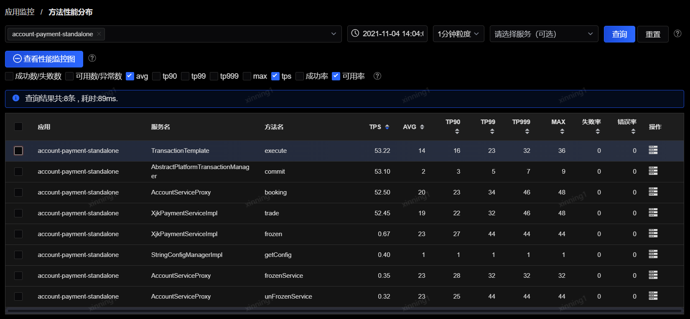

# 方法性能分布

通过性能监控图表中点击曲线图上某个时刻点，在弹出的下钻分析菜单中选择“方法监控”可以进入到此页面（详见“性能监控图表”中的描述），或通过直接点击左侧菜单中的“方法性能分布”菜单进入此页面。

 

该页面中，应用为必选项，可以选择多个应用；服务为可选项，如果不选择服务，则下方会查询出该应用下所有服务的所有方法的统计。

页面主体部分显示了检索出的所有方法的统计数据，包括TPS、AVG、TP90、TP99、TP999、MAX、失败率、错误率，点击最后操作列的“主机性能分布”按钮可以查看该方法在各个主机上的性能分布情况。

通过勾选方法、指标，点击“查看性能监控图”，可以跳转回性能监控图表，查看指定方法在特定指标下的性能趋势。
