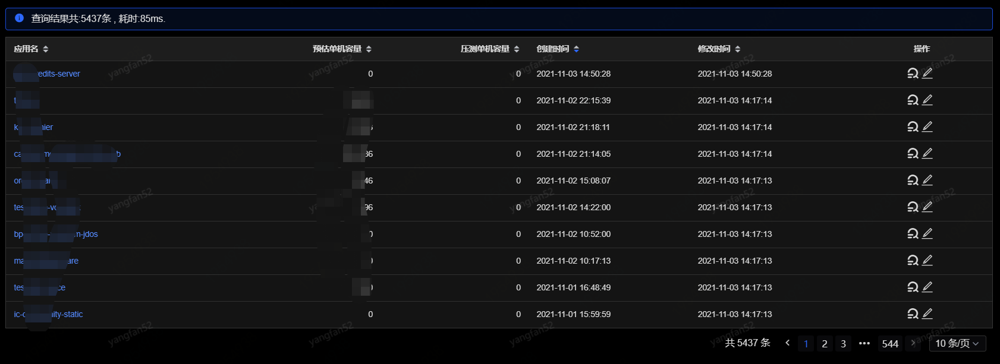
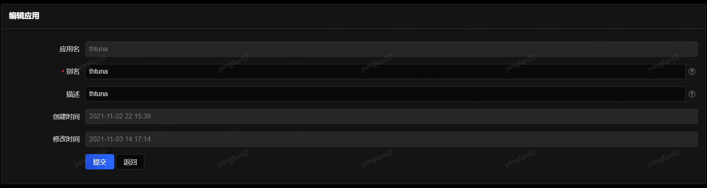
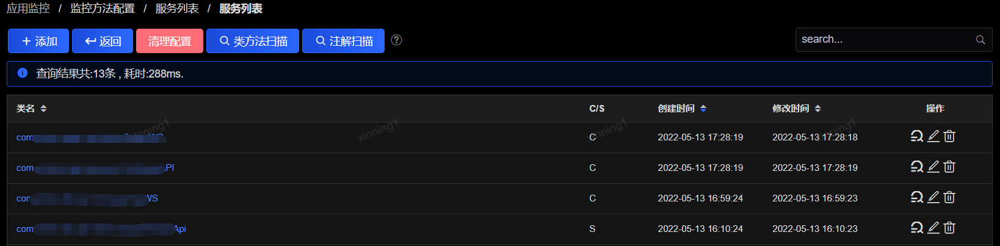
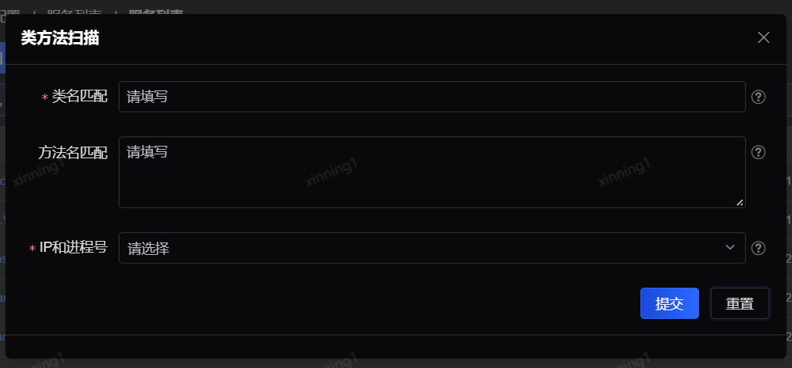
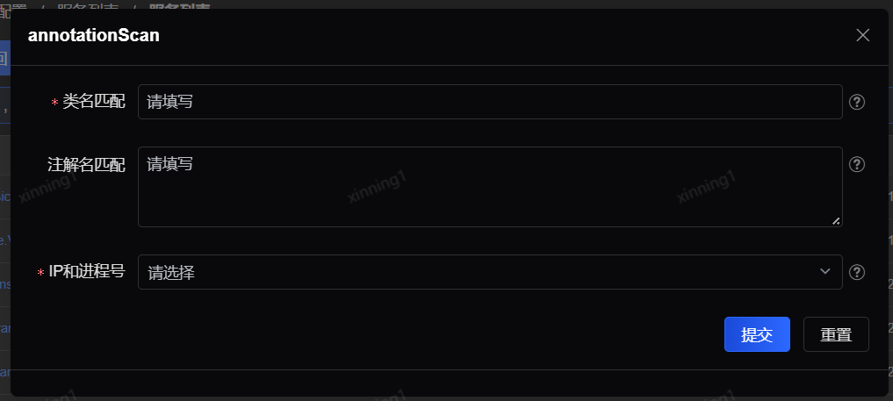
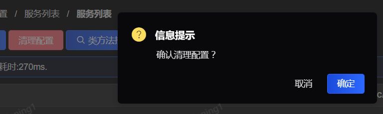
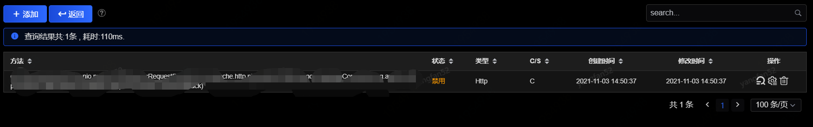
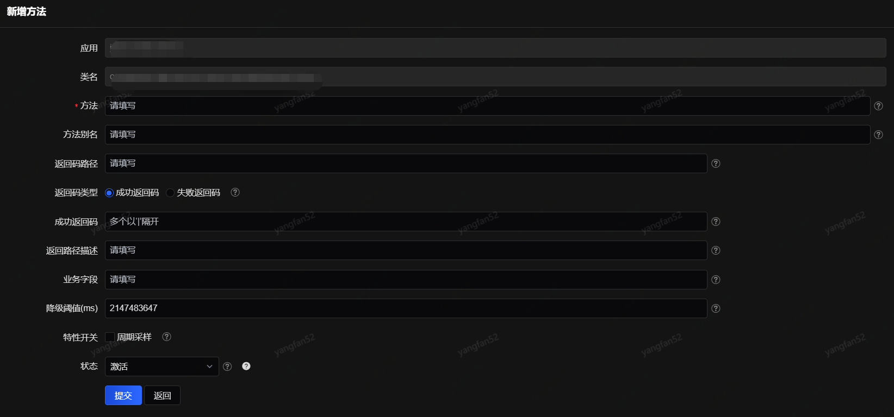

# 监控方法配置

SGM采用自动发现机制，自动找到应用名、需要监控的方法等，无需研发人员做任何配置。受SGM监控的应用、服务、方法都可以在监控配置中找到。应用接入后可以到监控配置中找到对应的应用、服务及方法，并修改相应的监控配置。

SGM默认会对DUBBO的方法（客户端及服务端）、Spring MVC的Controller方法（RequestMapping注解）、新浪Motan、带注解的restful、webservice、Activmq、Rocketmq等进行监控，即这些方法不需要添加任何配置就可以自动监控。如果要监控这些方法之外的方法，需要单独添加。默认监控可以满足一般的业务需求。

监控配置分别提供了针对应用、服务、方法三个层级的配置功能。

1. 应用层级配置
 

应用层级配置主要是应用的描述信息。点击最后一列“修改”，可修改应用的别名和描述。

 
“修改”按钮旁边的按钮是“调用查询”，点击可跳转到“方法调用查询”中以该条记录所属应用为查询条件的调用查询页面，详情参见“方法调用查询”小节。

2. 服务层级配置

点击应用列即可进入服务监控配置页面：
 

服务层级配置包括修改服务的描述信息（点击最后一列“修改”）和新增服务，该功能将在下面的“方法层级配置”中和新增方法功能一起详细介绍。

和应用层级的监控类似，在操作中点击“调用查询”也可以直接跳转到以该条记录所属服务为查询条件的“方法调用查询”页面。与应用监控配置不同的是，服务可以被删除（点击“修改”按钮旁边的“删除”按钮）。注意，如果删除的是SGM默认自动发现类型的接口所在的服务，下一次刷新时SGM仍然会上报这类服务。

顶部操作按钮还提供了清理配置、类方法扫描、扫描注解的功能。

 
类方法扫描可以通过配置类名、方法名、IP和进程号，自动扫描符合的方法进行注册监控，类名匹配和方法名匹配支持正则表达式，系统仅扫描pubilc方法，如果为空表示扫描匹配到符合的类下的所有方法。

 
扫描注解可根据配置的类名匹配、注解名匹配、IP和进程号，自动扫描符合的注类下的注解名，其中类名匹配和注解名匹配支持正则。
 

清理配置可清理无任何调用记录数据的配置。

3. 方法层级配置

点击服务配置列表中的某个服务即可进入方法层级的配置页面。和服务配置一样，方法配置也可以添加、修改和删除。
 

按照如下方式添加新的方法配置：

如果新增的方法所在类没有配置，需要先新增服务。首先需要在服务监控配置页中点击“添加”按钮，填写新增服务内容。填写完类名之后保存，新增服务成功。点击刚才新增的服务，进入方法层配置页面，点击“添加”按钮：
 

上图中的应用、类名会自动带出，方法是必填选项。如果不关心方法的返回码、返回状态，或者使用了系统默认返回码，则“返回码路径”、“返回码”、“返回描述路径”这些字段都无需配置，否则需要按照每个编辑框后面的解释说明进行配置。

- 方法

填写方法定义，参数需要填写全路径，比如，参数为String，则在相应的参数位置填写java.lang.String，多个参数以逗号分隔。

示例1 带参数：方法名(参数1全类名,参数2全类名,参数3全类名）

示例2 无参数：方法名()

示例3 getInfo方法：getInfo(java.util.List,java.lang.String,java.lang.Integer,int)

注意：不支持写泛型或者接口类，也不能写成java.util.List<java.lang.String>这种格式。

如果方法签名的参数是泛型，请使用java.lang.Object。比如：

getInfo(T t)

getInfo(java.lang.Object)

示例4 方法参数为内部类对象：

内部类com.A.B.ClassA对象作为参数时，需要写成：方法（com.A.B$ClassA）

- 返回码路径

配置方法的返回码，即哪个字段表示成功或者失败。如果返回码是原始数据类型（int，string等）或者是SGM系统定义的默认返回码路径中的一个（responseCode,retCode,errorCode,resultCode,remoteCode,returnCode,code,CODE,rtnCode,resCode），则此处无需配置。

配置方式如下：如果返回对象中的ret字段表示返回码，此处填写ret即可；如果返回对象是个复合对象，对象中ret也是个对象，ret中的code字段表示返回码，则此处填写ret/code。以此类推。

- 返回码类型

返回码类型配置选择，如果返回码中只有某一个或几个表示成功，请选择成功返回码；反之，如果只有一个或几个表示失败，请选择失败返回码。一般而言使用成功返回码较为合理。

- 成功/失败返回码

配置返回码值为多少表示成功(支持正则表达式)，系统默认0表示成功，可以是多个，即正则表达式0+表示，除此之外，success、true、200、ok也表示成功。如果默认规则能够满足，则此处无需配置。如果有接口已经定义其他成功返回码，如1111表示成功，此处填写1111，多个值用逗号分隔。注意，如果定义的失败返回码正好与系统默认的成功返回码相同，这时请一定要配置这一选项，否则有可能出现成功率曲线图上的效果与实际情况恰好完全相反。

- 返回描述路径

配置接口返回描述的路径，即哪个字段表示这笔调用的描述（一般为失败的原因）。如果返回描述是系统定义的默认返回描述中的一个（responseDesc,responseMsg,retDesc,retMsg,errorDesc,errorMsg,responseMessage,errorMessage,resultMessage,retMessage,msg,MSG,desc,DESC,resultDesc,resultMsg,errMsg,resMsg,message,description,info,INFO），则此处无需配置。

配置方式为：如果返回对象中的msg字段表示返回描述，此处填写msg即可；如果返回对象是个复合对象，对象中msg也是个对象，msg中的xxx字段表示返回描述，此处填写msg/xxx。

- 业务字段

业务字段一般为满足业务需求而配置，在配置了扩展字段后，SGM Agent将会按照配置，在调用发生时将对象中的值提取出来，并发送到服务端，用于查询或配置业务级监控指标等。例如，配置订单号为扩展字段，在SGM中日志搜索中就可以直接输入订单号查询。再例如，配置商户号为扩展字段，则可以配置以商户为监控维度的商户大盘。

配置方式为：n/xxx，多个扩展字段以逗号分隔，其中n为第n个参数，从0开始。如果是返回对象中的属性，则用@开头，xxx为参数中的属性，如果xxx为一个对象，扩展字段在xxx对象中的yyy属性，则配置为n/xxx/yyy或者（@/xxx/yyy）,以此类推。

- 状态

设置是否启动这个方法的监控，关闭后SGM将不再监控此方法，直到再次打开。

以上各项根据需要配置完成以后，点击保存，方法添加完毕。如果方法的“状态”设置的是启动，那SGM将开始监控所添加的方法。

SGM判断方法调用成功与否的标准如下：

首先，接口调用是否抛出异常。如果有异常则默认为失败。

其次，如果接口返回的是原始类型，分成两种情况：

1）	默认为成功。

2）	用户指定成功/失败返回码，则以配置为准。

再次，如果接口返回的是对象类型，再次分成两种情况：

1）	用户没有指定返回码路径，系统将自动查找默认返回码路径（responseCode,retCode,errorCode,resultCode,remoteCode,returnCode,code,CODE,rtnCode,resCode），与用户指定的或系统默认的成功返回码（0+,success,true,200,ok）比较，匹配则表示成功。

2）	如果用户指定了返回码路径，则通过该次调用中此字段的值与用户指定的或系统默认的成功返回码（0+，true，TRUE，success，SUCCESS）比较，匹配则表示成功。
修改方法监控配置的页面与添加新配置的页面基本相同，除以上介绍的参数外，还包括其他的一些方法信息，例如RPC类型和接口类型等。