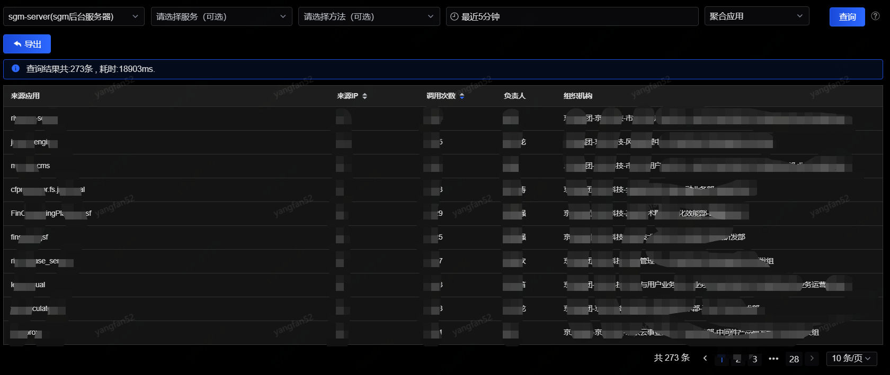

# 调用来源

调用来源分析是重要的排障手段，SGM不仅在图表监控中提供了对已接入SGM的调用来源的查询，也可以通过独立的“调用来源”菜单查询所有接入和未接入SGM的调用来源。
 

1. 查询

可根据应用、服务、方法、时间、聚合条件作为查询条件，应用、时间和聚合条件为必填项。

- 时间区间：最大跨度为1天，能查询到ES上索引未被删除的所有日期（一般为半个月左右）。

- 聚合IP/应用：从IP和应用两个维度来统计，聚合IP会按IP统计来源IP个数和调用次数，聚合应用会按应用来统计来源IP和调用次数。

2. 展示

- 来源应用：展示查询的应用（或服务或方法）的上游应用。

- 来源IP：如果是根据应用聚合，展示上游应用的IP数量；如果根据IP聚合，展示上游应用的IP。

- 调用次数：如果是根据应用聚合，展示上游应用的调用次数；如果根据IP聚合，展示上游应用和IP的调用次数。

- 负责人：展示应用的负责人。

- 组织机构：展示应用所属的组织机构。
