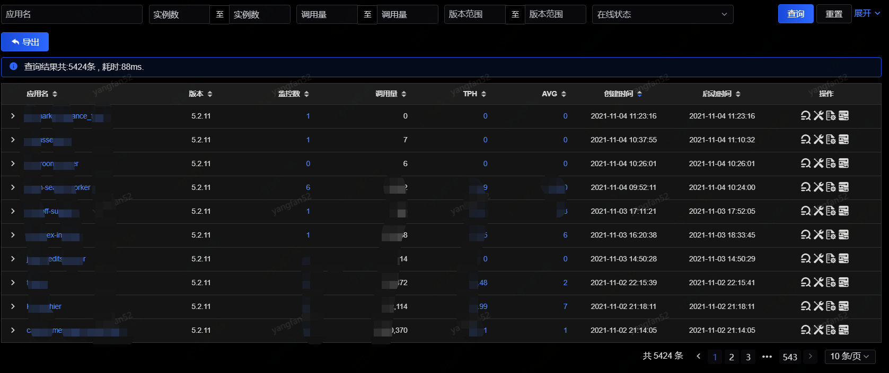
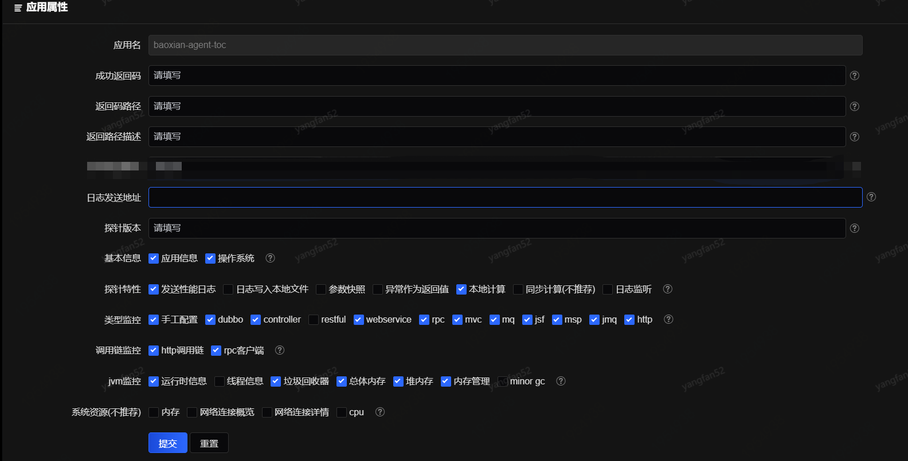
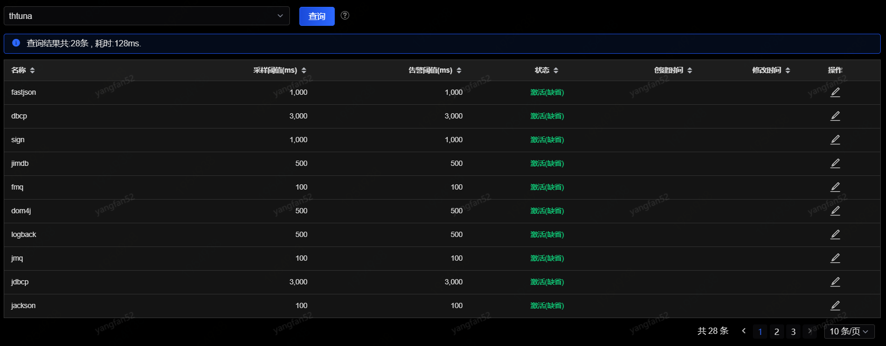
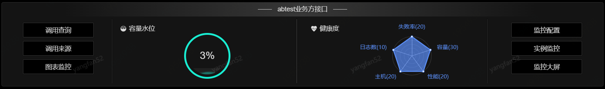
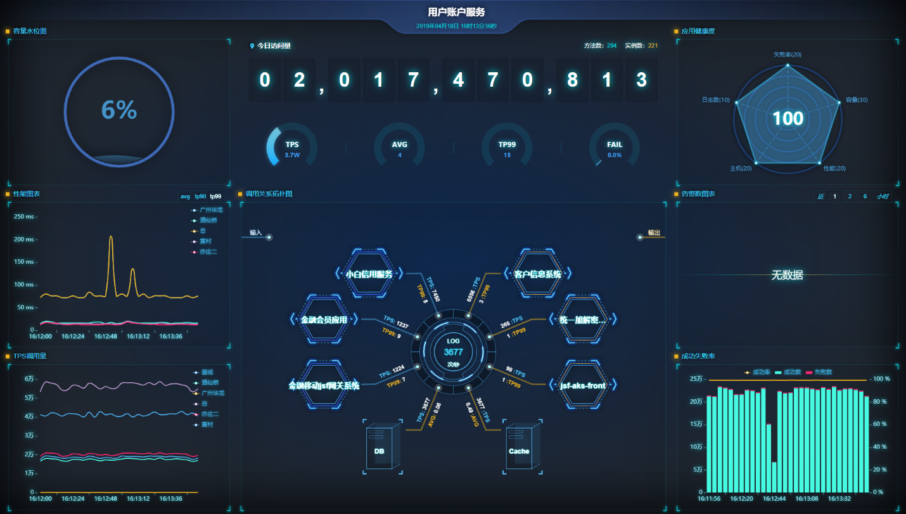
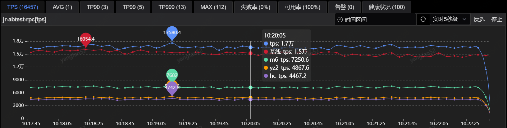
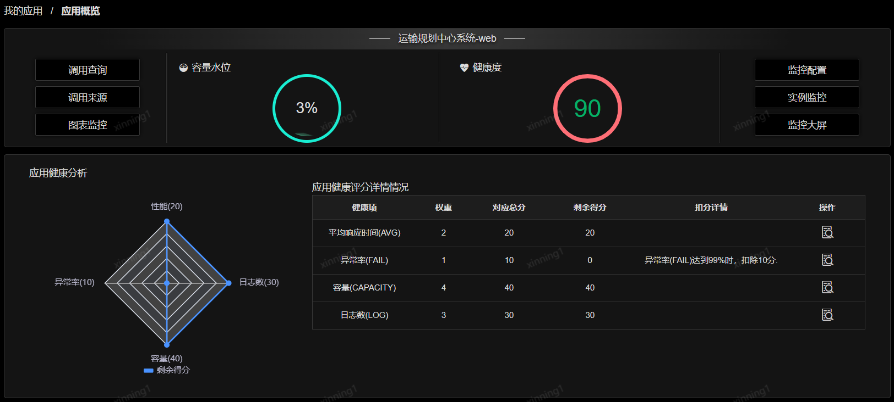
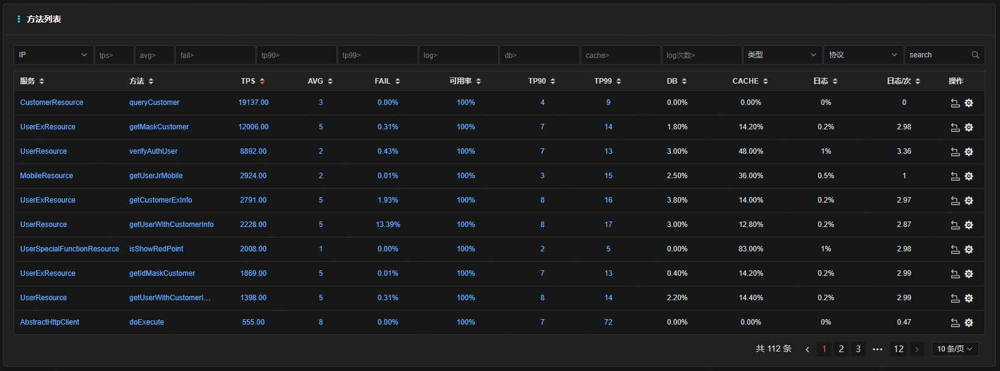
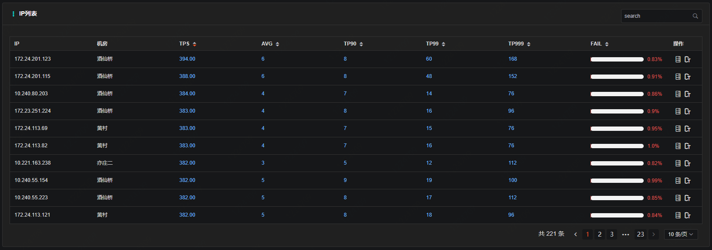
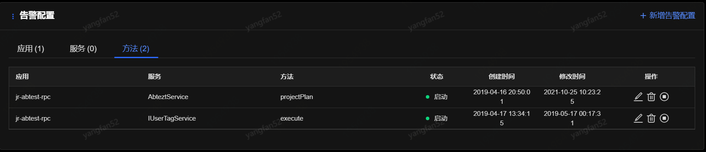

# 我的应用

“我的应用”可以查看用户权限范围内的已接入的应用详情，包括版本、监控数（节点数）、创建时间等重要信息。

 
**应用基本信息**

- 应用：已接入的应用名称；

- 版本：应用所引用的SGM jar包版本，其中以绿色显示的是snapshot版本，白色显示的是release版本；

- 监控数：接入成功的实例总数；

- 调用量：当天被调用的次数；

- TPH：TPS/总机器数，点击该列可链接到TPS监控曲线图表；

- AVG：平均响应时间，点击该列可链接到AVG监控曲线图表；

- 创建时间：接入SGM平台的时间；

- 启动时间：最近一次启动的时间；

**四大功能按钮**

每条接入记录的最后一列提供了四个功能按钮，从左至右依次为：“调用查询”、“应用属性”、“查看服务”、“底层监控”。

1. 调用查询

“调用查询”跳转到了以该条记录所属应用为查询条件的调用查询页面，详细可查看[方法调用查询](../App-Monitor/Log-Search.md)中的介绍。

2. 应用属性

“应用属性”可以配置应用发送日志的模式以及应用监控的内容等选项。

 
- 成功返回码：配置返回码值为多少表示失败(支持正则表达式)，如1111表示失败，此处填写1111，多个用“|”分隔，支持正则。

- 返回码路径：配置方法返回码路径，即哪个字段表示成功，如果返回码是原始数据类型（int，string等）或者是系统定义的默认返回码字段中的一个。（responseCode, retCode, errorCode, resultCode, code, CODE），此处无需配置。配置方式如下：如果返回对象中的ret字段表示返回码，此处填写ret即可，如果返回对象是个复合对象，对象中ret也是个对象，ret中的code字段表示返回码，此处填写ret/code,以此类推。

- 日志发送地址：日志发送地址，正常默认不需要修改，如有特定接收集（例如压测集群），可在这里选择或填写集群编号、名称等。

- 基本信息：sgm采集的基本信息开关（应用信息、操作系统）。

- 探针特性：sgm特性配置开关。

    - 发送性能日志：sgm性能监控开关，关闭后将不采集tps、avg、失败率等监控数据；

    - 日志写入本地文件：开启后sgm的监控日志将在本地日志文件中打印；

    - 参数快照：开启后底层方法监控将被抽样采集（例如数据库、缓存的底层方法，包括扩展信息）；

    - 异常作为返回值：开启后如果系统抛出exception时，配置了此返回为成功，则按成功计算；

    - 本地计算：开启后才能查看秒级（1s、5s、10s）监控；

    - 同步计算：sgm采集性能数据时和业务线程同步执行，开启后可能会影响系统性能；

    - 日志监听：当调用sgm的探针api获取sgm原始监控日志以及调用链id时，需要开启此选项；

- 类型监控：Dubbo监控、jsf监控、controller监控、http客户端监控、rpc客户端监控等是SGM默认都会监控的类型，其中rpc客户端监控包括dubbo、jsf的客户端监控。

3. 查看服务

“查看服务”会跳转到该应用下所有服务的一个列表，可查看[监控方法配置](../App-Monitor/Monitoring-Configuration.md)中的详细介绍。

4. 底层监控

“底层监控”跳转到“应用监控”下的“底层监控配置”页面。

 
从接入列表这里进入的是针对某一个指定应用的底层监控，一般是cache、db等的调用，单独设置采样阈值和启用状态（这里单独设置的采样阈值不能小于全局默认的采样阈值），这样设置完之后，这类型的方法将会与其他普通方法监控区分开来，报警的阈值也会单独处理。“状态”列会有默认缺省状态，使用时根据实际要求修改即可。

**应用概览**

点击每条接入记录的应用列，可跳转到“应用概览”菜单中对应应用的页面。

“应用概览”菜单将应用的整体概览集成在一个页面中，比如容量水位、健康度、TPS曲线等。

 
上图中，“调用查询”、“调用来源”、“图表监控”、“监控配置”和“实例监控”分别跳转到[方法调用查询](../App-Monitor/Log-Search.md)、[调用来源](../App-Monitor/Remote-Invoke.md)、[性能监控图表](../App-Monitor/Chart.md)、[监控方法配置](../App-Monitor/Monitoring-Configuration.md)、[进程实例监控](../App-Monitor/Instance-Monitoring.md)，详细可查看对应文档中的介绍，这里只对“监控大屏”进行详细介绍。

 
- 今日访问量：实时显示当日总调用量，每增加1亿次调用页面会展示烟花效果。

- 调用关系拓扑：拓扑图分为三个区域，左上区域展示所有来源应用的名称、TPS、TP99,右上区域展示所有远端应用的名称、TPS、TP99，中下区域展示DB、Log、Redis等底层的TPS、AVG值。

- 容量：圆圈内显示的是应用当前水位，默认每两小时刷新一次，刷新时间频率可根据应用数目灵活配置。

- 健康度：雷达图内显示从容量、性能、日志数、失败率、主机五个方面综合评估的应用健康程度分数，默认每两小时刷新一次，刷新时间频率也可根据应用数目灵活配置。

- 性能：以4s为间隔刷新应用的avg、tp90和tp99。

- 调用量：以4s为间隔，分机房显示应用调用量。

- 告警信息：展示告警规则TOP7和告警分类占比。

- 成功率：以4s为间隔，展示应用的成功数、失败数和成功率。

回到“应用概览”页。

 
上图中顶部各标签页上的数值除告警和健康状况外都是近一分钟的数值，告警默认显示近1小时的告警总数，健康度默认显示近两小时的健康状况。

 
应用健康度是根据应用的平均响应时间、异常率、容量、日志四个维度指标数据综合计算出来的，在上图中以雷达图的形式进行呈现，在这里可以看到每一项健康评估项的权重、对应总分、实际得分，如果某些评分项有扣分，可以在“扣分详情”栏中展示扣分的原因，鼠标悬浮时浮层展示完整信息，点击扣分项后边的查看按钮，可以快速跳转对对应问题的分析页面，定位健康受损的原因并予以处理，减少故障处理时间。

 
上图展示“我的应用”的方法列表，顶部提供多种要素的搜索功能，“操作”列支持跳转到“调用查询”和方法的“方法监控配置”。

上图展示“我的应用”的IP列表，按IP分别展示各服务器的TPS、AVG、TP90、TP99和失败率等指标，也提供到各服务的JVM监控和主机监控（跳转到主机监控平台）的跳转。

上图按“应用”“服务”“方法”分别显示告警配置，可直接在“操作”列修改、删除或者暂停/启动告警配置，如果想添加告警配置，点击右上角“+”即可。具体的告警配置规则可查看[添加告警配置](../Alarm/Add-Alarm.md)中的详细介绍。
