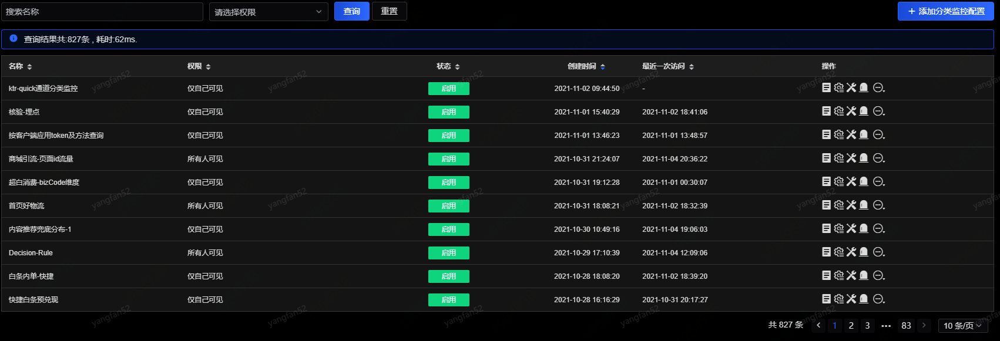
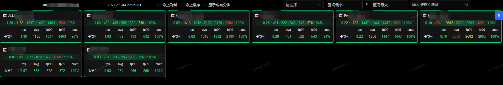
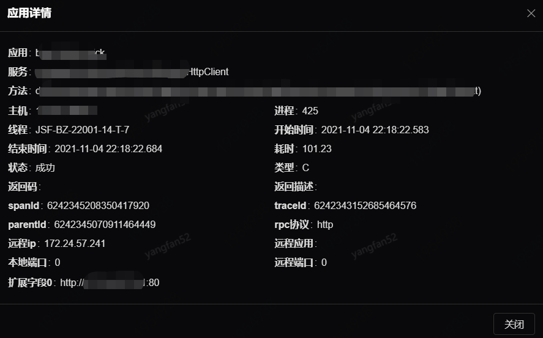
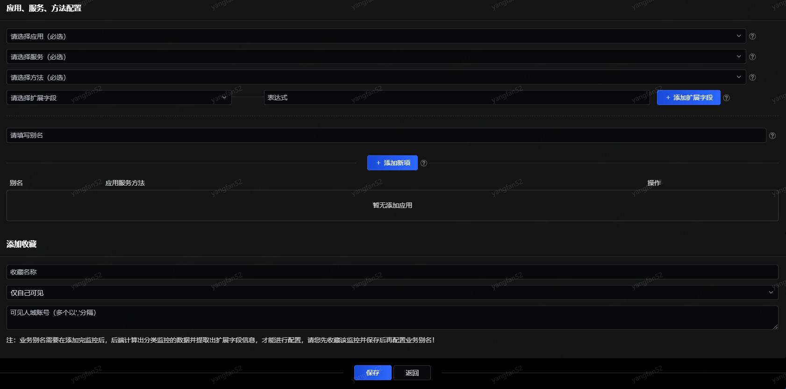
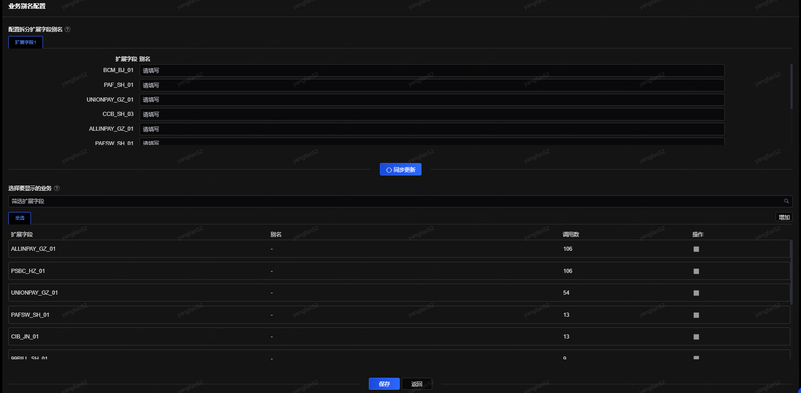
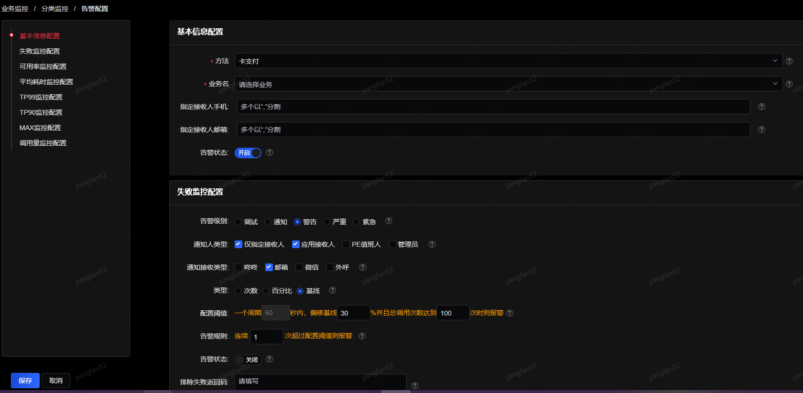
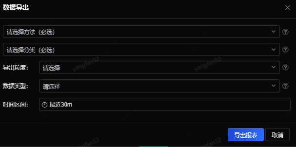

# 分类监控

分类监控是指通过提取方法中某一个或多个参数字段，按照业务属性进行分类统计的一种监控手段。例如与银行交互的接口中，指定银行编号字段为提取参数，按照不同的银行编号来对不同的银行进行监控。如果单独一家银行接口出现问题，那银行方面出问题概率较高，反之，如果所有的银行的接口都出现问题，则内部出现问题的概率更高。

进入分类监控后，展示收藏保存的分类监控列表，如下图所示：

可进行的操作包括：查看监控、监控配置、修改业务别名、告警配置、以及导出报表。

1、查看监控

1）停止刷新：停止收集性能或失败数据，页面排序也会随之停止；

2）停止排序：停止页面排序，但性能或失败数据仍然继续收集；

3）显示所有分类：页面默认只显示有调用的分类，选中此勾选框则会显示所有分类。此功能只对自定义分组有效；

4）监控指标：支持对TPS、AVG、TP90、TP99、TP999、MAX、SUCCESS这几种类型指定其对应值所在区间进行筛选，例如，可以筛选TPS为10~30之间的所有业务，同时按成功率进行排序，就可以监控指定业务的成功/失败情况；

5）搜索框：支持对扩展字段原始值和别名进行模糊查询，筛选出包含输入内容的业务。

2、监控配置

点击右上角“添加分类监控配置”按钮进入配置界面。

分类监控本质上是提取方法的业务扩展字段，因此在配置分类监控之前，需要首先配置方法的扩展字段（即业务字段），详细方法见[“监控方法配置”](../App-Monitor/Monitoring-Configuration.md)。配置完成后，可以通过查看“应用监控”下的“方法调用查询”菜单确认配置是否成功，点击操作列的“详情”页面：

该页面最下方展示了配置成功的扩展字段值（配置完成后可能需要等待数分钟）。

扩展字段（即业务字段）配置完成后，如下图所示进行详细的方法配置：

配置需要监控的应用、服务、方法和扩展字段，这四项皆为必填项，选定扩展字段后，如果需要对扩展字段的值进行操作，比如取字符串中的中间几个字符，可以在表达式中编写取值的方式。每个扩展字段填写好以后，点击“＋”进行添加，该扩展字段及表达式会出现在下方，可通过“－”进行删除操作。所有的扩展字段填写完毕后，需要为这项监控取别名（必填项），然后点击“添加新项”，添加到下方列表中。如果需要添加其他的应用、服务、方法的扩展字段，可以按照上述方法继续添加。最后，添加的所有方法会以所取的别名为标识，展示在该页面的下方列表中。

可以在添加收藏中添加此分类是否收藏。收藏可分为仅自己可见、所有人可见和仅组内可见。

3、业务别名

如下图所示进行业务别名配置：

页面上半部分显示的是多组扩展字段的值及赋予这些字段的别名。如果在上一步“方法配置”中选择了多个扩展字段，则这里会显示相应行数的扩展字段别名。每一行的扩展字段别名都可以分开配置，例如，对扩展字段2中的PAF_SH_01取别名，在输入框中输入“中国建行银行”，编辑完成别名后，点击“更新”按钮，在页面下方就可更新显示扩展字段的别名、调用量。如果需要对这些扩展字段组合进行分组，点击“选择要显示的业务”右侧的“增加”按钮，然后在下面选择业务并输入分组名，保存即可。新添加的分组依次展示在“全部”标签页的后面。

注意：

（1）所有操作完毕后需要点击“保存”按钮才能生效。

（2）在收藏监控后，后端服务计算出分类监控的数据并提取出扩展字段信息，才能进行业务别名的配置。

4、告警配置

告警配置的项目将在第7节“告警配置”中详细阐述，配置完成后点击“下一步”进入“业务别名”。如果需要对多个业务进行个性化告警定制，可点击“个性配置”。

5、数据导出

提供导出某一时间段某种时间粒度下，某些扩展字段的性能监控或者失败监控的数据。

导出的可选条件依次为：导出粒度、导出类型、导出时间区间，导出的报表以excel文件保存。