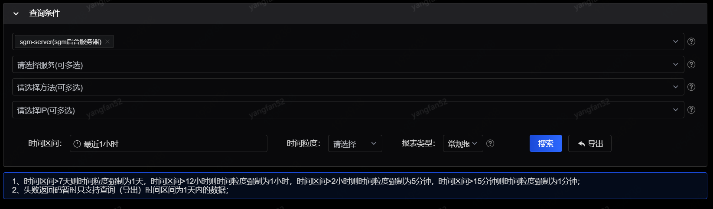
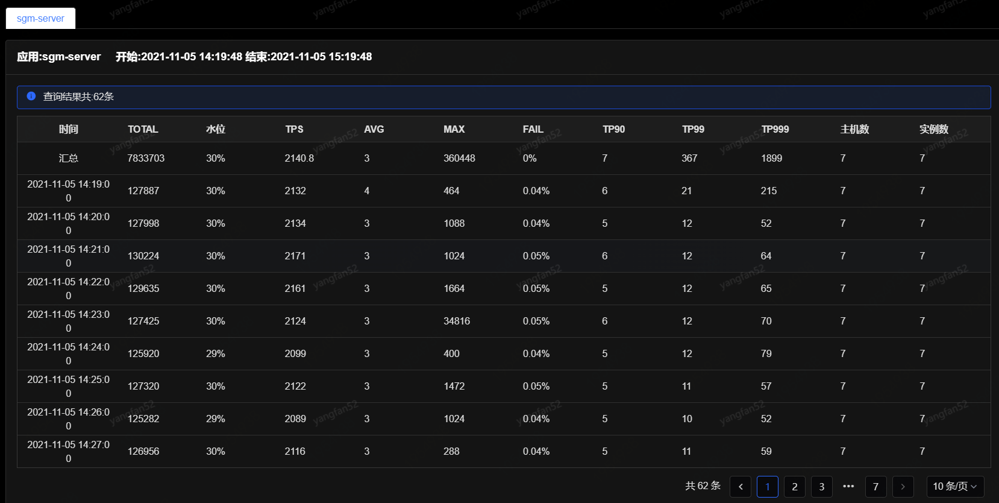
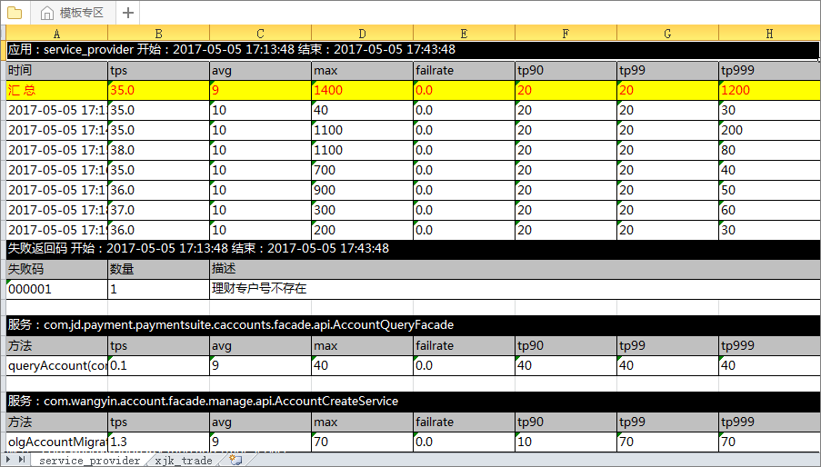

# 数据报表

数据报表提供将图表监控中的图表数据转化为数字并以文档形式导出保存，可同时导出多个应用。

数据需要先查询再导出，查询条件中应用和时间区间为必选项，其他为可选项。时间粒度会随着所选择的时间区间自动带出，时间区间>7天则时间粒度强制为1天，时间区间>12小时则时间粒度强制为1小时，时间区间>2小时则时间粒度强制为5分钟，时间区间>15分钟则时间粒度强制为1分钟。可以同时选择一个或多个应用进行搜索，如果选择多个，则不允许进一步选择服务和方法。条件选择完成之后，点击“搜索结果”，在下方分别展示出查询应用的TPS、AVG、FAIL、失败率等数据。多个应用之间可通过列表上方的多个标签页切换显示。

点击“导出报表”按钮导出查询结果中所有应用的监控数据，格式为EXCEL，且文件名以“sgm_****”保存。导出后的EXCEL文档示例如下：

