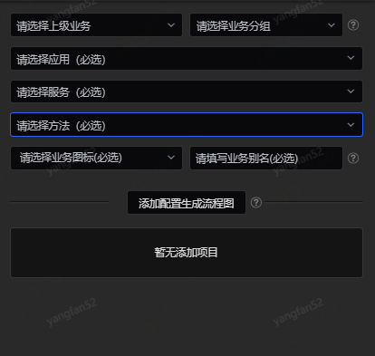
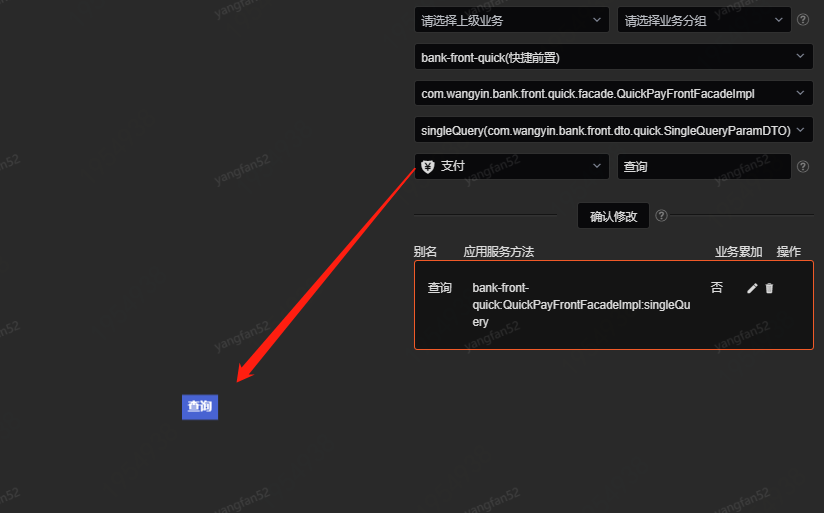
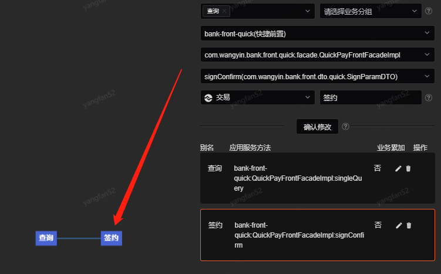
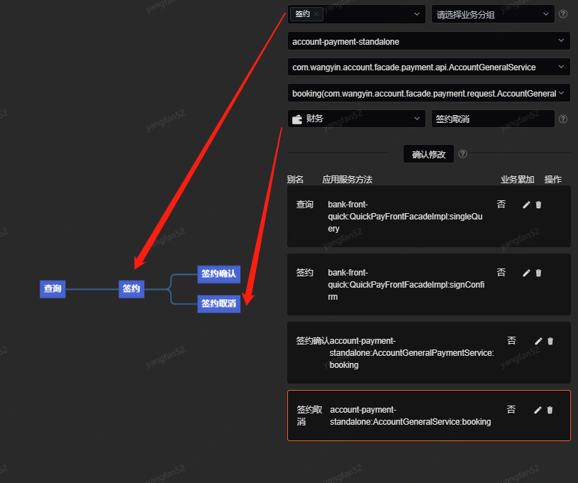
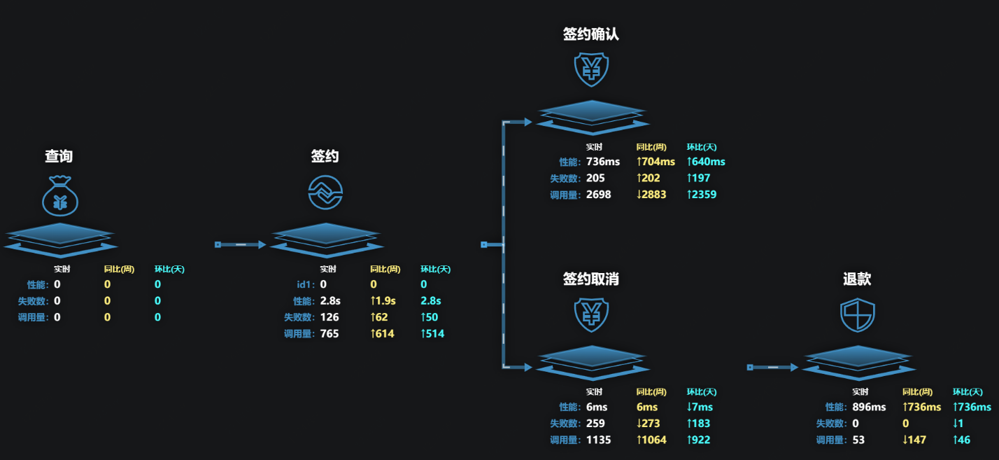
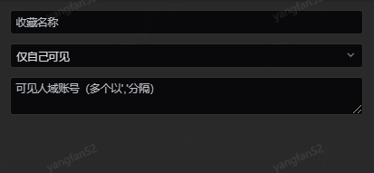

# 流程监控

从业务的角度，通过配置应用、服务、方法、以及扩展字段的方式，来组建一个业务流程走向，对每个流程节点进行监控，包括性能监控和业务累加数据监控，其中业务累加数据是根据方法配置中,对扩展字段的取值进行累加。流程监控能针对独立流程，实现更直观的全方位监控。

1、监控配置

上图为流程监控的监控配置页面。

- 上级业务：流程图中的上级节点。
- 业务分组：如果多个节点被划分为一个分组，则他们会显示为一个节点，失败数、调用量、业务数据会被叠加，性能数据取其平均值。
- 应用、服务、方法：必选项，为各节点对应的应用服务方法。
- 是否添加业务累加数据：可选择业务字段来进行业务数据累加。
- 业务图标：显示在流程节点上的图标。
- 业务别名：显示在流程节点上的名称。

以下演示一个具体配置流程：

首先，选择第一个节点的应用、服务、方法。此时由于是第一个节点，因此没有上级业务和业务分组。此处选择不添加业务累加数据。选择节点图标，填写节点，点击确认完成第一个节点的创建：

继续添加第二个节点，第二个节点“签约”和第一个节点“查询”是前后级的关系，所以“上级业务”下拉框选择“查询”来建立两个节点在流程中的关系。选择好对应的应用、服务、方法之后，同时此处假设在业务上需要业务累加数据，因此打开“是否添加业务累加数据”开关。由于业务累加数据是针对业务字段进行累加，因此需要选择在监控配置中已经配置好的业务字段，并对累加值进行命名。

接下来创建一对并联节点。如下图所示，“签约确认”和“签约取消”两个节点是并联关系，并且是“签约”节点的下游流程，所以在创建这两个节点时，均选择“上级业务”为“签约”来建立这三个节点之间的流程关系：

最后一个节点“退款”将“上级业务”选择为“签约取消”。

所有节点创建完成后，点击“下一步”进行收藏，完成定制。效果如下图所示：

上图包含串联和并联关系的节点，并联节点的上级业务为同一节点。同比和环比分别表示上周和昨天同一时间段的数据比较情况。业务累加数据的粒度可选择5分钟、1小时和1天，其中1小时表示当前时间的前一个整点到当前时刻的累加数据，比如当前时间为16:36，则显示16:00至16:36之间的累加数据。其他性能数据每分钟刷新一次，统计的是每分钟内的总数或者平均数。

2、收藏配置

监控配置完成后可点击下一步进行收藏配置。

