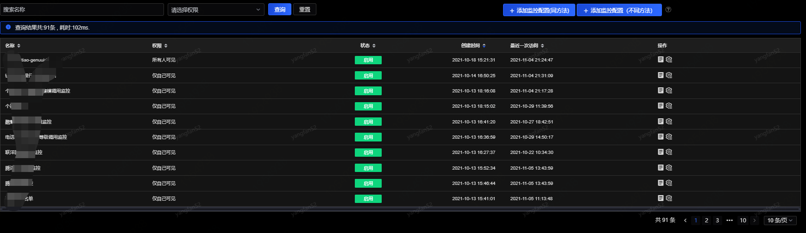
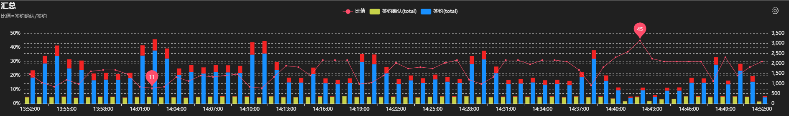
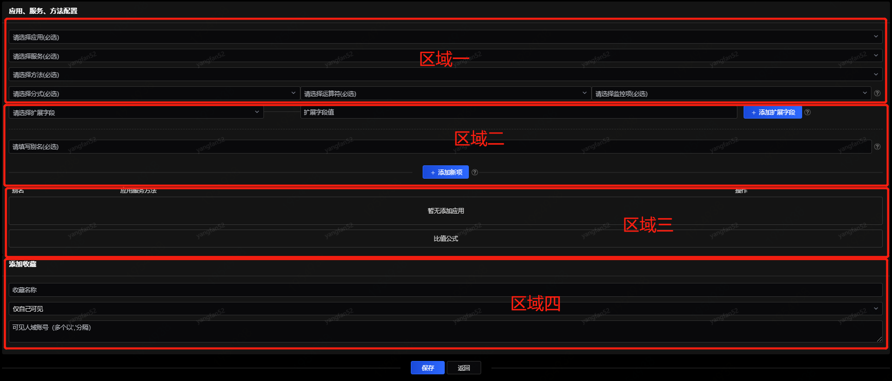
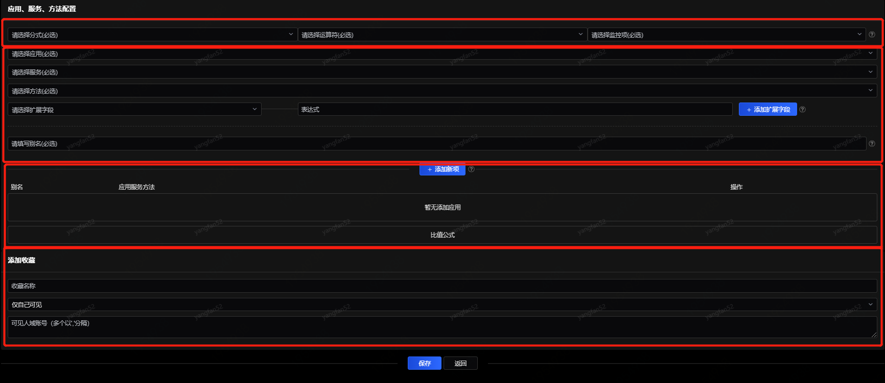

# 比值监控

比值监控是通过指定不同方法的调用量（成功、失败、全部）分别作为分子和分母，将产生的比值作为监控指标的一种监控手段。例如以支付的成功量作为分子，下单的成功量作为分母，产生的比值即为支付转化率。

进入比值监控后展示可见的收藏比值监控列表，如下图所示。右侧操作包括“查看监控”和“监控配置”。

1、查看

上图中曲线即为比值监控图，鼠标置于曲线之上可查看具体数值，右上方的配置图标用于针对这个监控进行单独的告警配置：

默认状态下告警状态是关闭。

2、监控配置

新增监控配置包括同方法和不同方法两种类型：

- 同方法

同方法配置仅适用于对同一个方法的扩展字段进行配置。

- 不同方法

不同方法配置既可以对两个不同方法进行配置，也可以针对两个不同方法的扩展字段进行配置。

上图比值监控的配置页面分为四个区域：

（1）区域一：配置子项在分式中的位置（分子或者分母）、运算符（加、减、乘、除）和监控项（全部、成功数、失败数）。例如要配置的公式为（A+B）/（C-D），D代表的监控项是成功数，则在添加D这个子项时，区域一内的下拉框分别选择“分母”、“减”、“成功”。

（2）区域二：该区域为扩展字段的配置区域。如果需要对扩展字段的值进行操作，比如取字符串中的中间几个字符，可以在表达式中编写取值的方式。每个扩展字段填写好以后，点击“＋”进行添加，该扩展字段及表达式会出现在下方，可通过“－”进行删除操作。所有的扩展字段填写完毕后，需要为这项监控取别名（必填项），然后点击“添加新项”，添加到下方列表中。如果需要添加其他的应用、服务、方法的扩展字段，可以按照上述方法继续添加。

（3）区域三：在区域二配置完成的监控项会显示在该区域的列表中，可以对这些配置进行修改或删除。

（4）区域四：为此监控命名并配置收藏。