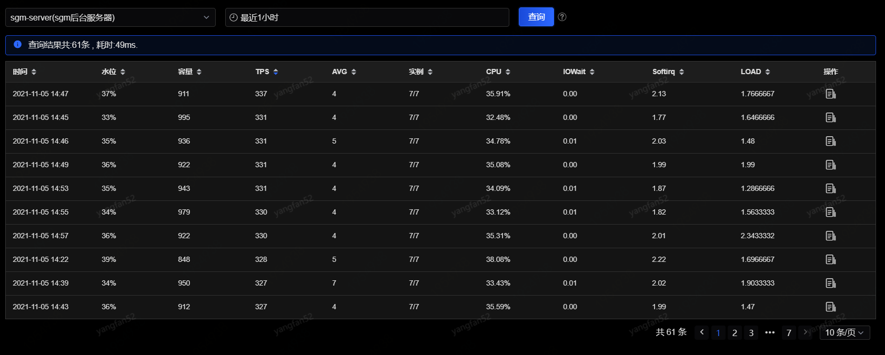
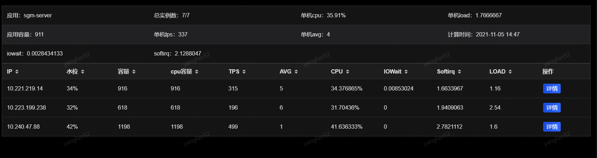
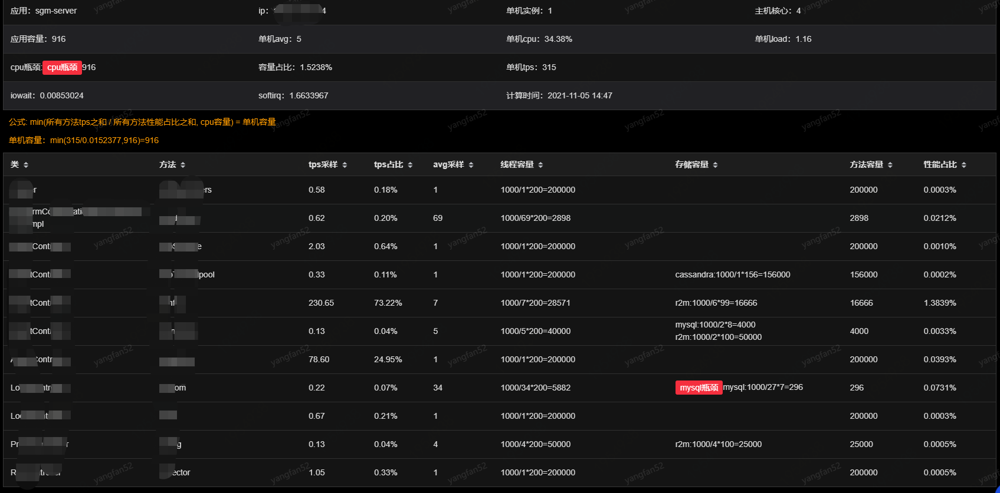

# 容量计算明细

应用的容量每分钟计算一次，可以在该页面查看某应用在某个时间区间内的容量计算详情。在最后一列，点击“主机详情”，可以查看所选时刻最多十台主机的单机容量详情，这十台主机是从大于单机平均TPS的主机中随机选取的十台，不足十台则展示全部主机。

点击某主机最后一列的“详情”按钮可进一步查看该主机的线程容量、存储容量、方法容量及容量瓶颈等。

单机容量= min(所有方法tps之和 / 所有方法性能占比之和, cpu容量)

