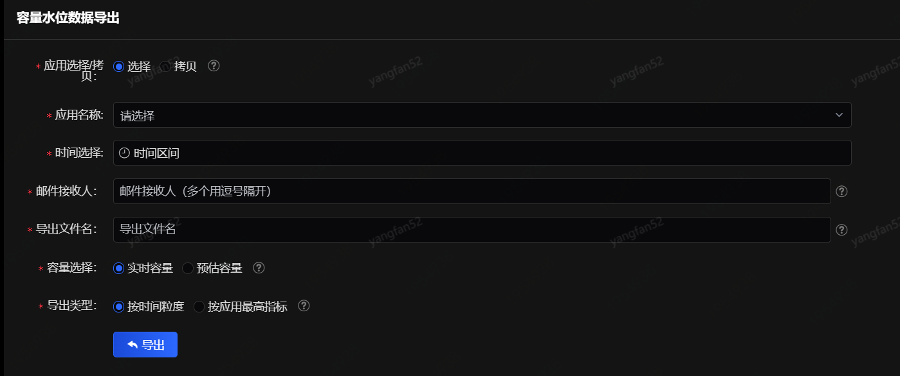
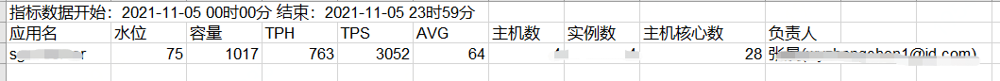

# 容量水位导出

为了方便统计，可以导出应用在指定时间区间内的容量水位等数据。

此导出功能为异步操作，系统后台执行导出操作后，会以邮件形式发送；应用过多时会以多封邮件或者多个附件的形式发送。

l 应用选择/拷贝：支持手动选择已有应用，可以多选；也支持拷贝文本中的多个应用（以回车分割多个应用）

l 容量选择：

实时容量：和性能数据在同一时间点计算出的容量；

预估容量：在TPS最高时段计算出的容量；

l 导出类型：

按时间粒度：指定区间以分钟为粒度的详细水位数据；

按应用最高指标：按应用为单位导出每个应用的最高指标；

导出内容以excel作为附件，包含应用名、水位、容量、TPH、TPS、AVG、主机数、实例数、主机核心数、负责人等信息，如下图所示：

