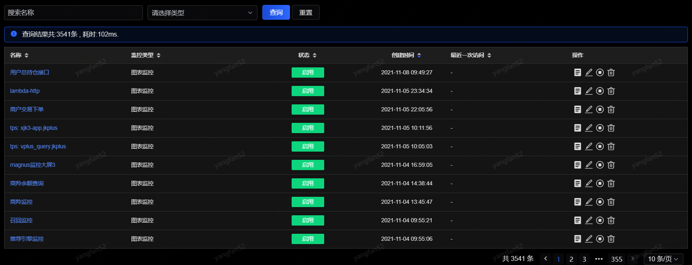
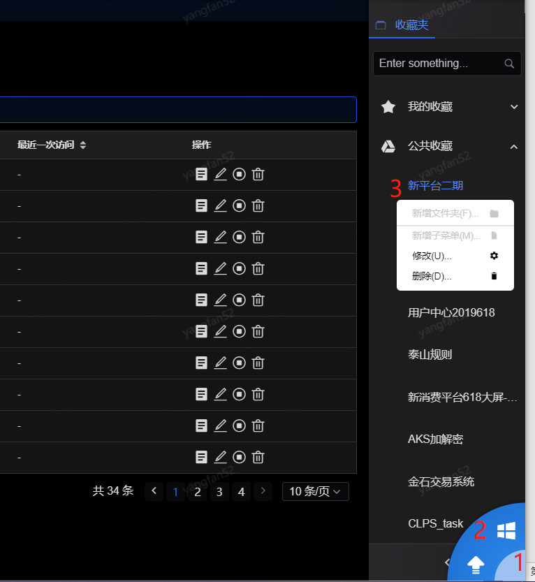
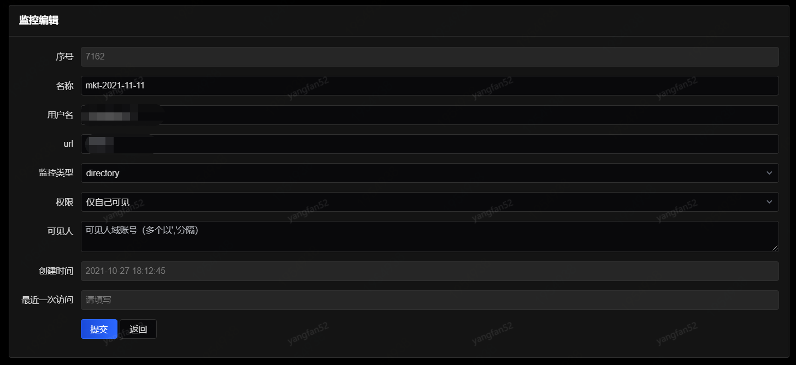

# 我的收藏
“我的收藏”中展示权限为仅自己可见的收藏列表。点击名称或操作中的“查看”可跳转到此收藏监控的详情。收藏列表在“操作”选项中还提供编辑、禁用和删除等操作。

 
- 收藏夹

在任意页面点击右下角的图标，然后右击我的收藏后可添加文件夹（对应Directory）或子菜单（对应url）。在某个具体收藏监控上右击则可以修改或删除该收藏。

 
- 收藏类型

    url：来自收藏夹中的收藏监控，添加个性化收藏，可配置外部地址并收藏访问。

    Directory：来自收藏夹中的收藏监控，添加文件夹后配置多个监控。

    图表监控：来自应用监控中性能监控图表的收藏监控。

    分类监控：来自业务监控中分类监控的收藏监控。

    比值监控：来自业务监控中比值监控的收藏监控。

    环路监控：来自业务监控中环路监控的收藏监控。

    流程监控：来自业务监控中流程监控的收藏监控。

- 编辑：提供收藏监控的编辑功能。
 

    
   建议编辑时只修改名称、权限和可见人。

- 禁用：禁用后不能访问此监控，但不会删除。禁用后的监控可再次启用。

- 删除：删除后不能恢复。
