# 首页

sgm-console（即SGM控制台）首页显示在当前用户权限下接入SGM的所有受监控的应用，如下图所示：
 
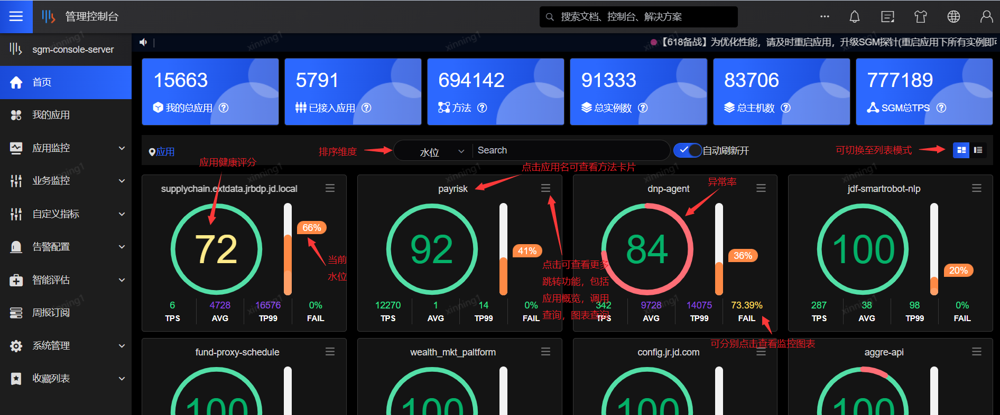

该页面最上方显示应用接入总览：

- 我的总应用：应用负责人或者应用联系人的应用总数

- 已接入应用：已经成功接入SGM的应用总数

- 服务：所有接入SGM的应用的服务总数

- 方法：所有接入SGM的应用的方法总数

- 总实例数：所有接入SGM的应用所在机器IP总数

- SGM总TPS：所有接入SGM的应用的总TPS

 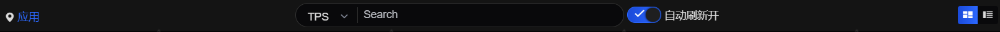

统计指标下方的一条操作栏，从左到右分别为面包屑、排序指标切换、搜索框、自动刷新开关、图表样式切换。

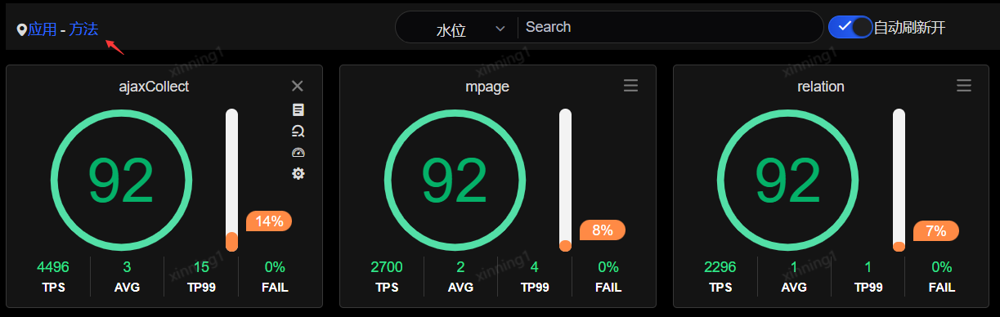
 
面包屑显示当前页面所处的层级，默认显示应用，当点击下方的应用名称后，跳转到当前选中应用下的所有方法的图表，面包屑位置会显示“应用-方法”，点击面包屑上的应用可以返回到应用层级的图表。

 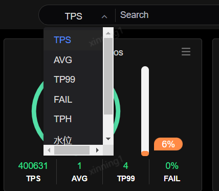

排序指标默认按照TPS进行排序，可以通过下拉框切换为使用其他指标进行排序，系统支持按照TPS、AVG、TP99、FAIL、TPH、水位进行排序。通过切换不同的排序指标，可以有侧重点的对应用进行监控和分析。

例如：可以选择按照AVG排序，将方法平均耗时长的应用排在前面，便于快速定位因方法执行耗时过长导致体验受损的应用，或者按照FAIL排序，将失败率高的应用排在前面，快速定位业务返回码失败率高的应用并下钻分析失败原因。

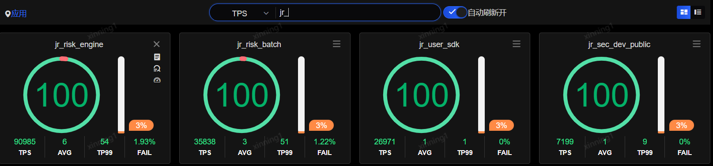
 
排序指标切换右边的是搜索框，默认情况下系统首页显示按照排序指标的top30应用卡片，top30之外的应用数据可通过输入应用名称进行检索，支持模糊搜索，清空搜索框后再次点击回车键则还原显示top30应用。

搜索框右侧是自动刷新开关，默认为开启，系统每4秒对当前展示的top30应用进行排序，每分钟则对所有应用重新排序并刷新展示。关闭自动刷新开关后，将不再自动刷新应用卡片。

 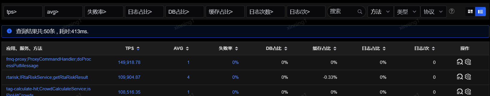

该行最右侧为图表展示方式切换控件，默认按照卡片方式展示，可以切换为表格方式展示。

切换为表格展示方式后，在表头顶部可以进行tps、avg、失败率、日志占比、DB占比、缓存占比、日志次数、日志/次等指标的筛选，过滤条件含义如下：

- tps大于：tps（每秒钟调用次数）大于该值

- avg大于：方法平均耗时大于该值

- 失败率大于：平均失败比率（返回码失败的次数/总次数）大于该值

- 日志占比大于：日志耗时占全部耗时的比值大于该值

- DB占比大于：DB耗时占全部耗时的比值大于该值

- 缓存占比大于：缓存耗时占全部耗时的比值大于该值

- 日志大于：日志耗时占比大于该值

- 日志/次大于：每次调用打印日志的次数大于该值

查询条件中的“应用、方法”选择框，默认选项是“应用”。当选择“应用”时，列表中按照应用层级进行汇总展示，操作中的调用查询将跳转到以应用为查询条件的页面。当选择“方法”时，列表会按照应用服务方法的组合维度进行汇总统计，操作中的调用查询也将跳转到以应用服务方法的组合维度为查询条件的页面。选择“方法”时，还可进行方法类型（服务端、客户端）及方法调用协议（如Dubbo、JSF等）的筛选。

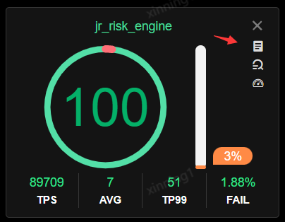
 
点击应用卡片右上角图标，会弹出扩展功能菜单，包含：我的应用、调用查询、图表查询。

- 我的应用：点击可跳转至当前应用的应用概览页面（详情可参考“我的应用”）。

- 调用查询：点击可跳转至方法调用查询并自动选中当前应用（详情可参考“方法调用查询”）。

- 图表查询：点击可跳转至性能监控图表并自动选中当前应用，以及预设的指标图形，包括TPS趋势，AVG趋势，成功率趋势和成功数失败数柱状堆叠组合图，可用率趋势和可用数异常数柱状堆叠组合图（详情请见“性能监控图表”）。

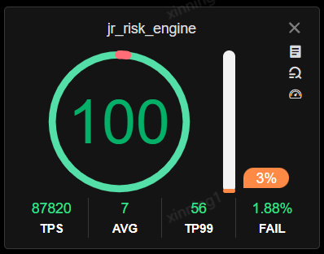
 
应用卡片中圆圈内的数字显示的是该应用当前的健康评分，健康评分反映了应用当前的服务质量是否处在健康的水平上，满分100分制，当应用的健康评分较低时，说明应用再某些方面出现了问题，可能是方法的响应时间很长，可能是异常率很高，需要点击查看详细的评分分析。

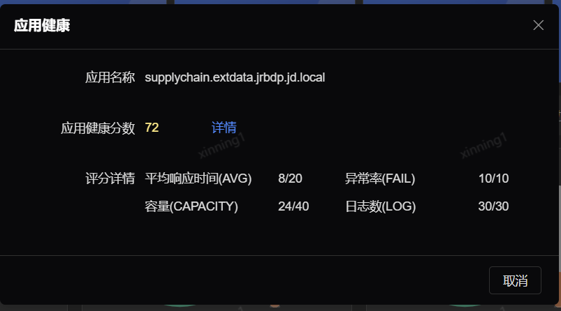
 
点击健康评分的分数，在弹出的窗口中可以看到当前分数的详细结果，系统从平均响应时间（AVG），异常率（FAIL），容量（CAPACITY），日志数(LOG)四个方面对应用进行综合打分，从该界面中可以您可以大致了解到当前应用主要扣分点是在哪个方面，点击详情链接可以继续对评分问题进行进一步的分析。

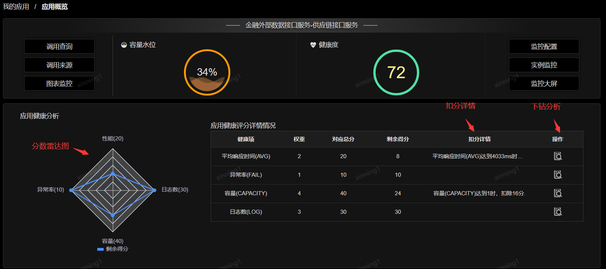
 
点击评分的详情后，可以跳转到当前应用的概览页，展示了应用健康评分的雷达图，以及详细评分项、扣分、扣分原因的表格，继续点击扣分项右侧的查看按钮，可以跳转对应对的分析页面定位问题。

首页应用卡片的柱状图显示的是当前应用的水位线，水位线反应了一个应用的容量状况，当应用的水位线过高时，应用的响应会变慢，错误率会升高，导致服务质量迅速下降，因此应用管理者应时刻关注应用的水位线状况，在水位线超过健康阈值时，应立即进行问题分析，看是否需要优化方法的代码性能，或调整参数、扩容资源等。

应用的水位计算公式为：水位=TPS/（预估单机容量*总实例数）

水位的含义是，应用所有方法的调用量占所有机器总容量的占比。注意这里的TPS实际上是取得最近7天内最大得TPS，即，使用应用最近的TPS峰值进行预估。预估单机容量是系统通过评估当前应用下各个主机上运行的所有方法的调用量、耗时和CPU容量等因素进行综合评估计算得出。

应用的卡片上显示的TPS、AVG、TP99、FAIL和水位值可能会呈现出黄、橙黄、橙红、红色、紫色，这些颜色是根据应用配置的告警配置中的各指标阈值来改变。当应用未单独配置时，则遵循全局告警配置。

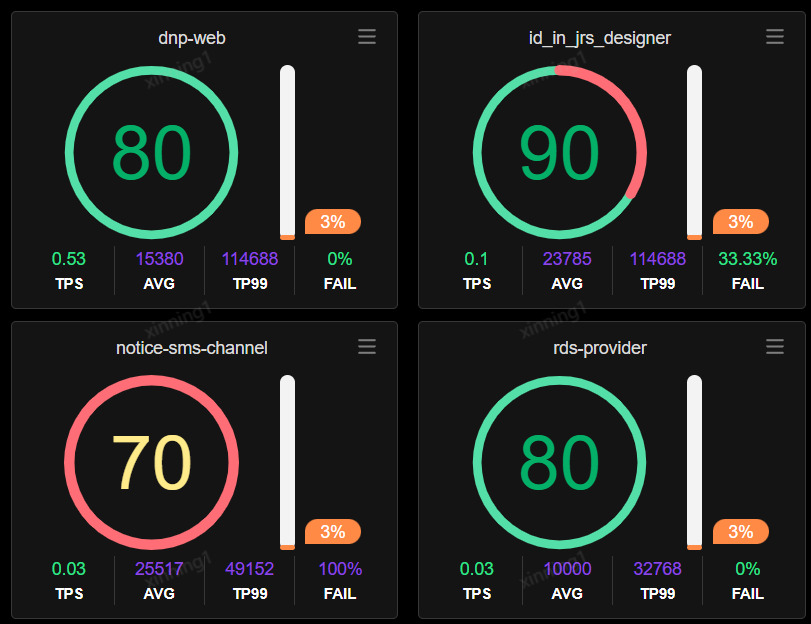
 
**TPS、AVG、TP99、FAIL变色规律：**

- 蓝绿色：当实际数值小于该告警阈值时，显示蓝绿色；

- 黄色：当实际数值超过该指标阈值但小于该阈值的125%时，显示黄色；

- 橙黄色：当实际数值超过该指标阈值的125%但小于该阈值的150%时，显示橙黄色；

- 橙红色：当实际数值超过该指标阈值的150%但小于该阈值的175%时，显示橙红色；

- 红色：当实际数值超过该指标阈值的175%但小于该阈值的200%时，显示红色；

- 紫红色：当实际数值超过该指标阈值的200%时，显示紫红色。

**水位值变色规律：**

- 蓝绿色：当实际数值小于预估容量值的50%时，显示蓝绿色；

- 橙黄色：当实际数值超过预估容量值的50%但小于该值的80%时，显示橙黄色；

- 橙红色：当实际数值超过预估容量值的80%但小于该值的100%时，显示橙红色； 

- 紫红色：当实际数值超过预估容量值的100%时，显示紫红色。

“图表查询”图标查看的是应用所有的监控图表，如果需要单独查看TPS或者其他数据，可点击每个应用方块内的TPS、AVG、TP99、FAIL进入：

- TPS：应用每秒钟处理的请求数

- AVG：应用对每个请求响应的平均时间

- TP99：99%的请求的响应时间小于或等于该值

- FAIL：应用对请求响应的失败比率（失败请求数量/总请求数量）

