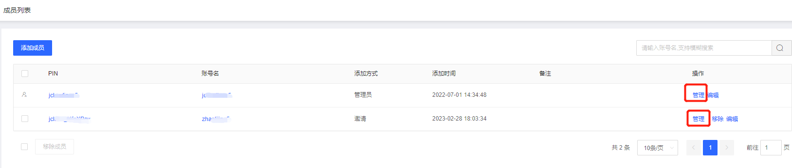
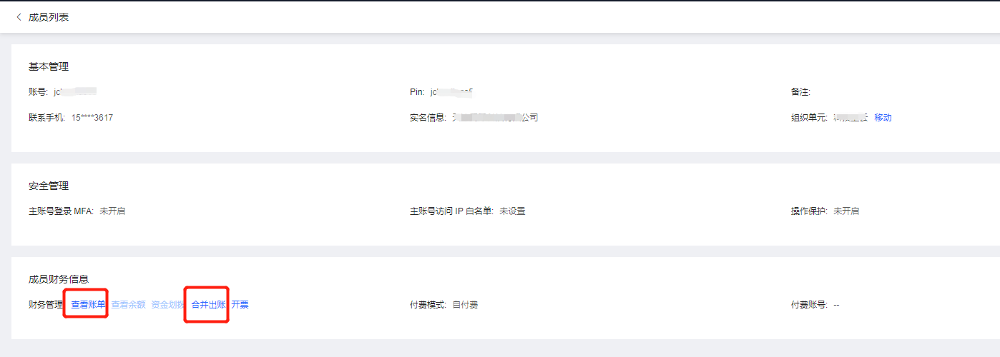
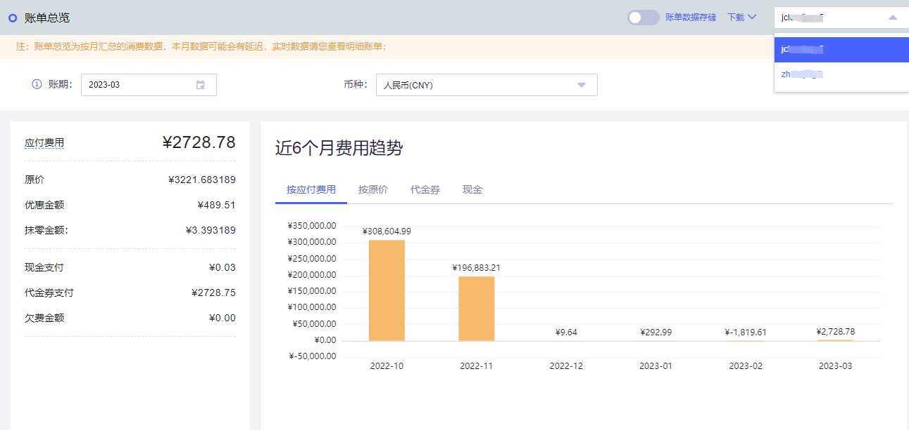
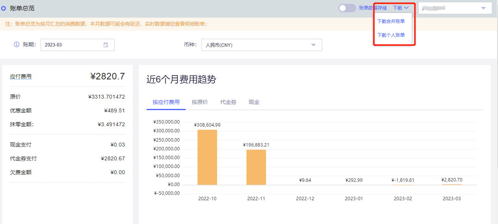

# 查看成员账号消费信息

本文介绍如何通过组织账号管理控制台，查看成员账号的消费信息。

### **操作步骤**

1.登录组织账号管理控制台，选择左侧导航栏中的 [成员管理-成员列表](https://org-console.jdcloud.com/organization/member)。

2.在“成员列表”页面，添加成员时，对“财务管理”进行维护。您可查看成员账号的消耗信息：

点击“管理”下的成员财务信息的“查看账单”可查看账单总览：

查看资源账单：您可查看成员账号的资源账单情况，详情请参见 [资源账单](https://cost.jdcloud.com/cost/consume/consume-bills/v2) 。

查看明细账单：您可查看成员账号的明细账单情况，详情请参见 [明细账单](https://cost.jdcloud.com/cost/consume/consume-history/v2)。

### **其他操作**

#### **下载账单功能**

在 账单总览 页面，点击“下载”可选择下载“管理员账单”或下载“合并成员账单”。

