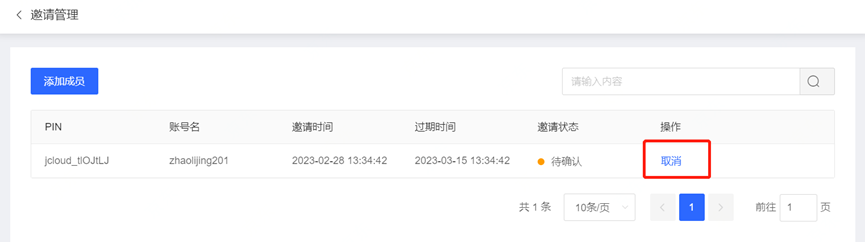

# 成员接收邀请及退出组织

## **一、用户查看被邀请信息**

用户可以通过组织管理控制台，查看被组织邀请信息。

### **1.1、操作步骤**

登录组织管理控制台，选择左侧导航栏中的 基本信息，即可查看记录。如下图所示：


> 说明：
>
> 当您在未加入任何组织时，可以查看被邀请信息。
>
> 邀请列表仅展示近三个月的被邀请记录。
>
> 单条邀请记录最长15天内有效。


## **二、用户接受或拒绝邀请**

用户可通过组织管理控制台，接受或拒绝组织邀请。

### **2.2、操作步骤**

登录组织管理控制台，选择左侧导航栏中的 [基本信息](https://console.cloud.tencent.com/organization/setting)，即可“基本信息”页面中查看在有效期内的邀请记录，单击 接受 即可加入组织。 如需拒绝加入该组织，单击拒绝即可拒绝加入。如下图所示：


> 说明
>
> 只有完成企业实名认证的用户才可加入组织。企业实名认证详情请参见 企业实名认证指引。
>
> 成员的企业实名主体要与被邀请人一致，或成员的企业实名主体已成功添加至认证主体信息。
>
> 加入组织后，被邀请列表将会隐藏，直到退出组织。


## **三、成员退出组织**

组织成员可以退出自己所在的组织。

### **3.3、操作步骤**

1.登录账号管理控制台，选择左侧导航栏中的基本信息。 

2.进入“基本信息” 页面，并单击删除组织。如下图所示：


3.在弹出的“删除组织管理”确认窗口中，单击确定即可退出组织。

如存在以下场景，则该成员无法直接退出：

组织管理员设置该成员不允许退出。

通过组织创建的成员。


组织创建者可以在被邀请人接受邀请前，进行取消邀请的操作。


### 操作步骤


1. 登录组织管理控制台，选择左侧导航中的[邀请管理](https://console.cloud.tencent.com/organization/invitations)。

2. 在“邀请管理”页面中，在成员邀请列表中，单击被邀请人所在行右侧的取消。如下图所示：

```

```

3. 在弹出提示框中，单击确定即可完成操作。