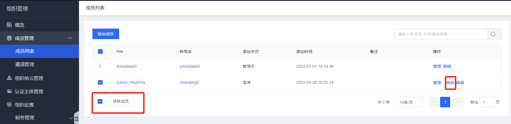

# 移除组织成员

本文介绍如何通过组织管理控制台，移除组织成员。


```
注意

移除组织成员后，将无法在成员列表中查看及编辑，在组织关系中显示及移动该成员。

组织创建者账号无法移除。
```


### **操作步骤**

1. 登录组织管理控制台，选择左侧导航栏中的[成员列表](https://console.cloud.tencent.com/organization/member)。

2. 您可移除单个或批量成员：

移除单个成员：选择成员所在行右侧的移除，在弹出确认框中单击确定即可。

批量移除成员：勾选成员名称左侧的复选框，单击成员列表下方的移除成员即可。


如下图所示：

```

```

