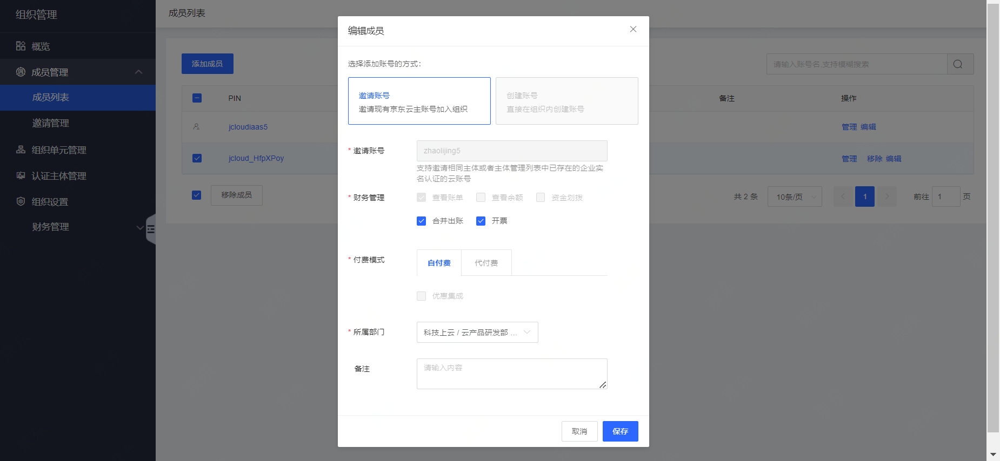

# 查看成员列表及成员基础信息

本文介绍如何通过组织账号管理控制台，查看成员列表及成员基础信息。

**操作步骤**

1. 登录组织管理控制台，选择左侧导航中的成员管理-成员列表，即可查看当前组织的成员信息。成员信息包含了账号名、账号pin、加入方式、添加方式、添加时间、备注等，其中财务权限、付费模式、所属部门可修改。

   

2. 在“成员列表”页面中，选择需查看详情的成员所在行，点击操作-管理或账号名进入。

   

3. 单击需更换所属部门成员所在行右侧的编辑，在弹出的“编辑成员”窗口中编辑成员信息，并单击确定即可保存修改。如下图所示：

   

