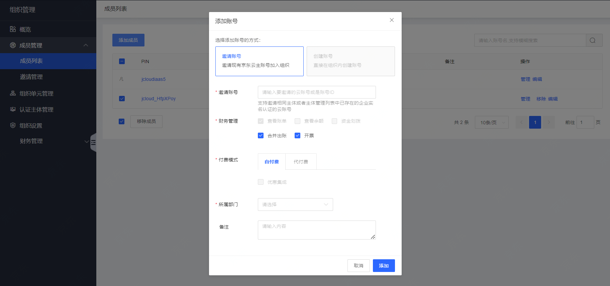

# 添加组织成员

组织创建者可以为组织添加成员，目前仅支持邀请成员。

###  **操作步骤**

1. 登录组织管理控制台，选择左侧导航中的[成员管理](https://console.cloud.tencent.com/organization/member)。

2. 在“成员列表”页面中，单击添加成员。

3. 在添加成员页面，默认选择“邀请成员”。如下图所示：

   ```
   
   ```

4. 依次按需填写账号 ID、财务权限、付费模式、所属部门及备注。其中，账号 ID 可前往[账号信息](https://console.cloud.tencent.com/developer)页面获取。

5. 填写完成后单击确定，会进行被邀请成员信息验证。被邀请账号ID 需要完成企业实名认证、认证主体和被邀请人相同且未加入任何组织，才可邀请成功。邀请成功后，邀请信息15天内有效。