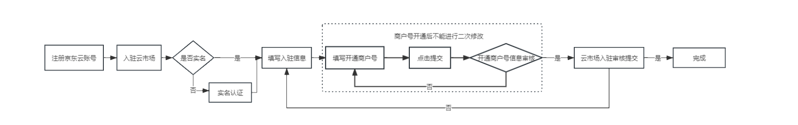
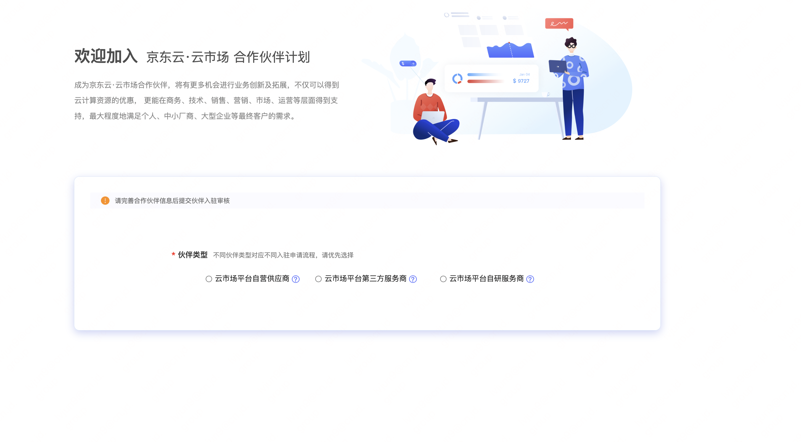
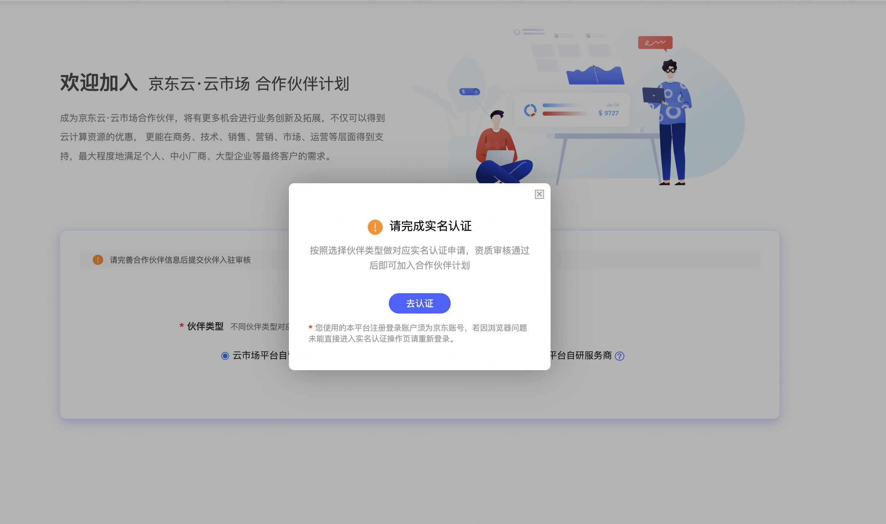
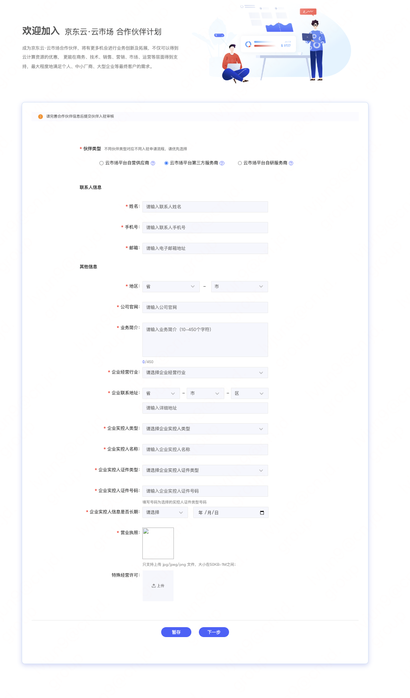
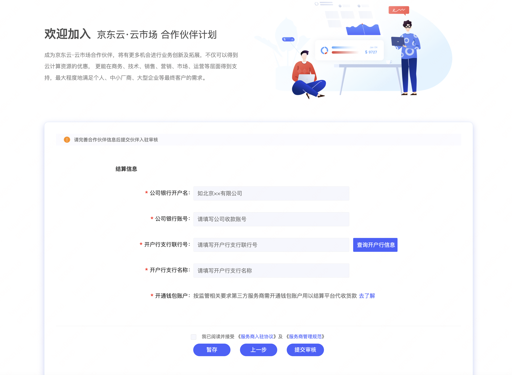

## 云市场钱包账号开通操作

为新注册云市场平台第三方服务商和已入驻的服务商开通服务商提供专属钱包结算账号，服务商可以通过钱包账户查看结算金额及余额详情。（目前为优惠期，账户开通及使用暂不收取费用，后期按账户每年收取费用，收费标准会提前发邮件告知。）  
请于2023年3月1日之前完成开通，如未按时开通，线上无法交易。

### 一、整理操作流程

### 二、新注册服务商操作流程
1、注册京东账号后，点击服务商入驻：[https://market.jdcloud.com/partner](https://market.jdcloud.com/partner)   

**未实名账号**，选择入驻伙伴类型，选择云市场平台第三方服务商。

未实名用户，点击填写实名认证信息。  

**已实名用户**，按照页面要求填写信息。  

