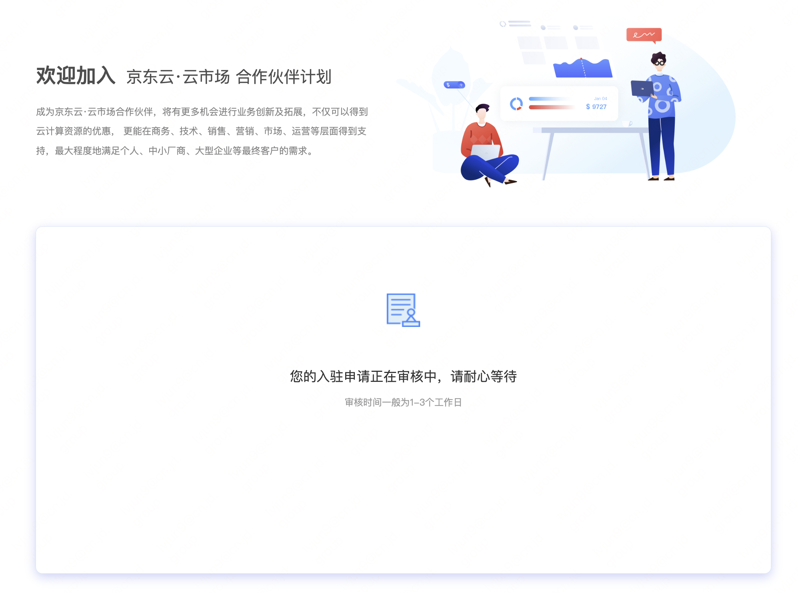
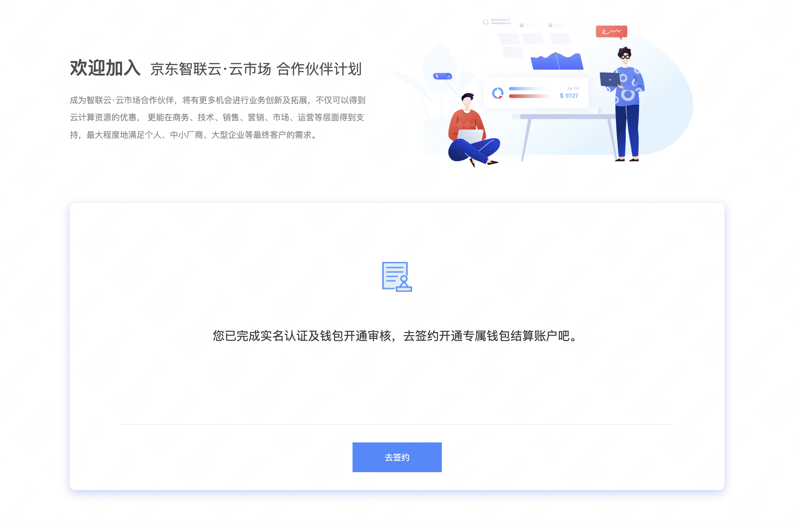
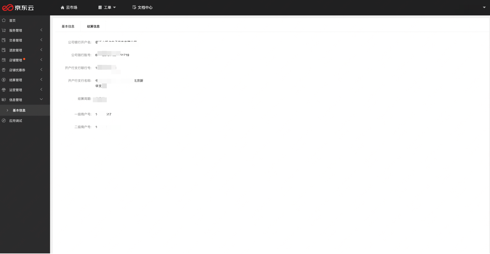
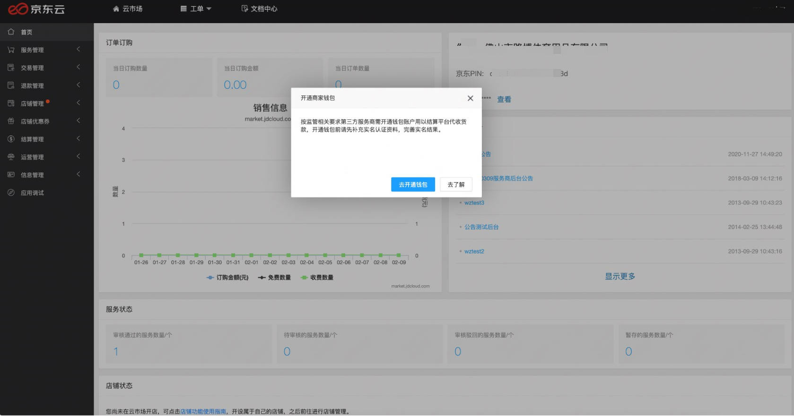
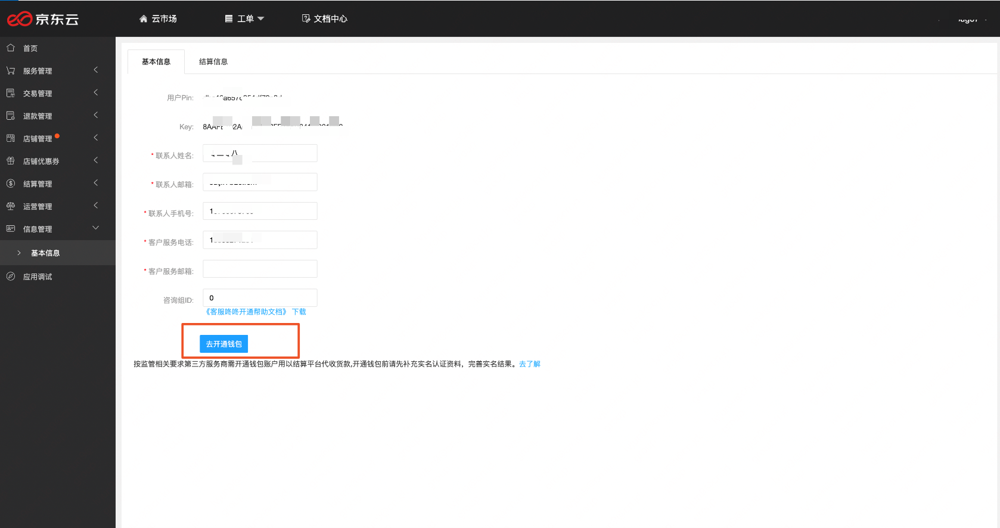
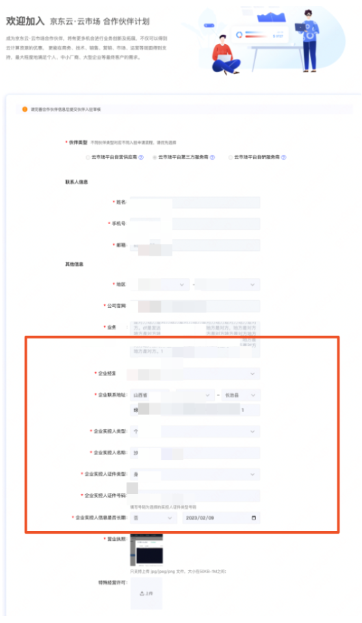
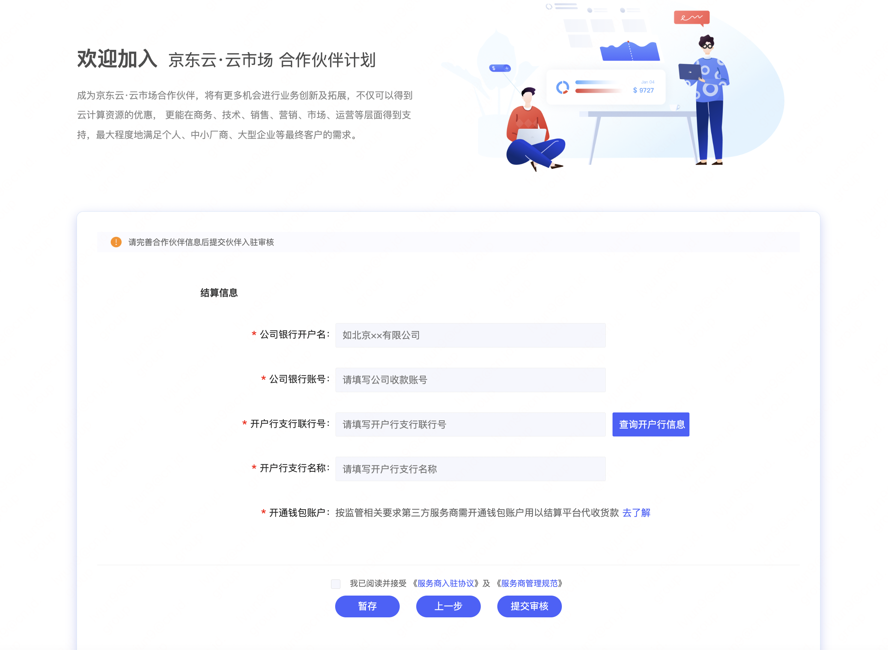

## 云市场钱包账户开通操作

为新注册云市场平台第三方服务商和已入驻的服务商开通服务商提供专属钱包结算账户，服务商可以通过钱包账户查看结算金额及余额详情。（目前为优惠期，账户开通及使用暂不收取费用，后期按账户每年收取费用，收费标准会提前以公告或邮件形式告知。）  
请于2023年3月1日之前完成开通，如未按时开通，服务商的线上服务无法进行交易。

### 一、操作流程

### 二、新注册服务商操作流程
1、注册京东账号，点击服务商入驻：[https://market.jdcloud.com/partner](https://market.jdcloud.com/partner)   
**未实名账号**，选择入驻伙伴类型，选择云市场平台第三方服务商。

未实名用户，点击填写实名认证信息。  

**已实名用户**，按照页面要求填写信息。  

2、**结算信息填写**，支持查询开户行信息功能，点击提交审核。   

3、点击提交后，1~3个工作日完成审核。  

4、商户号审核通过后，点击去签约，进入服务商入驻审核。  
  

5、云市场入驻信息审核通过后，在信息管理-基础信息-结算信息中看到商户号。  

### 三、已入驻第三方服务商操作流程
1、已入驻的三方服务商，登陆服务商管理后台后，服务商管理后台登录链接[https://msp.jdcloud.com/](https://msp.jdcloud.com/), 会有弹窗提示去完成开通钱包。

当弹窗被关闭可以通过信息管理-基础信息或结算信息页面找到开通钱包入口。  

2、填写开通钱包信息。  

3、结算信息填写，支持查询开户行信息功能，点击提交审核。  

4、点击提交后，1~3个工作日完成审核。  

5、审核通过后，在信息管理-基础信息-结算信息中看到商户号。  

### 四、查询余额钱包开通后，查询余额可以通过京东云账号登录http://biz.jd.com/index.html 查询余额。

如果您在操作上遇到任何问题可以发邮件：yunshichang@.com。会有专人为您解答。

  
