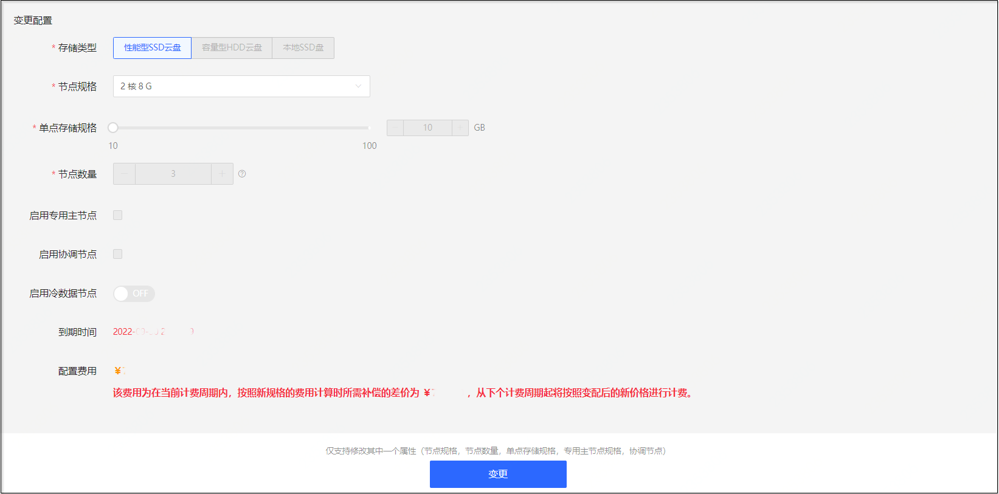

# 升配集群

随着业务的发展，您可能对集群的配置要求越来越高。当集群的配置无法满足您的业务要求时，可以通过集群升配功能，升级集群配置。
本文介绍了京东云搜索 Elasticsearch 集群升级配置的相关说明、注意事项和操作方法。

## 前提条件
- 集群为正常状态（绿色）。
- 完成集群规格容量评估。 评估方法，请参见 [规格容量评估](../../Best-Practices/Capacity-Assessment.md)。
- 检查集群中是否存在 **状态为 close 的索引**。如果存在，需要将 **对应索引的状态暂时设置为Open，否则变更不成功**。
  - 登录 Kibana 控制台，执行以下命令，查看索引状态。

  ```
  GET /_cat/indices?v
  ```
  
  - 登录 Kibana 控制台，执行以下命令，查看索引状态。<index_name>需要替换为状态为close的索引名称。
  ```
  POST /<index_name>/_open
  ```
  </br>
  
## 使用限制
- 每次只能变更一种节点类型（数据节点、冷数据节点、专有主节点、协调节点）的规格配置。
- 对于数据节点或冷数据节点，一次只能变更节点规格、磁盘容量或节点数量中的一项配置。
- 本地盘型的数据节点升级规格时，必须已经开启专有主节点。

</br>
  
## 注意事项

### 服务影响
- 升配集群会触发集群重启，重启时间与集群规格、数据结构和大小等因素有关，建议在业务低峰期操作。一般情况下，重启耗时较长，在小时级别。
- 如果集群为非正常状态（黄色或红色），请待集群恢复正常状态（绿色）再升配集群。

### 计费变化
提交了升配订单后，集群将按照更新后的订单计费。计费规则，请参见 [计费规则](../../Pricing/Billing-Rules.md)。
> 说明：在升配集群时，您可以在变配页面，实时观察更新后的订单消费金额。

### 分片分配
- 变更节点数后，集群不会自动重新规划分片，可能导致数据在分片上的分配不均匀。

</br>
  
## 操作步骤
1. 访问 [云搜索Elasticsearch控制台](https://es-console.jdcloud.com/clusters)，进入集群管理页面。或访问 [京东云控制台](https://console.jdcloud.com/)，点击顶部导航栏 互联网中间件-云搜索Elasticsearch，进入集群管理页。
2. 在您要变更配置的集群，选择 【**操作-更多-变更配置**】。
3. 在变更配置页面，展示了当前集群的配置信息，便于您在执行升配操作时参考。根据实际业务需求，通过页面提示修改实例配置。部分参数说明如下。</br>

| 参数 | 说明 |
| :-- | :-- |
| 数据节点 | - 当数据节点为**云盘型**时，您可以升配**节点规格**、 **单点存储规格**，以及**扩容节点数量**。</br> - 当数据节点为**本地盘型**时，您可以升配**节点规格**、以及**扩容节点数量**（**限制条件：必须已经开启专有主节点**）。|
| 专有主节点 | 支持开启专有主节点，或者升配已购买的专有主节点的规格。 详细信息，请参考 [专有主节点](../../Operation-Guide/Instance/Nodes/Dedicated-master-node.md)|
| 协调节点 | 支持开启协调节点，或者升配已购买的协调节点的规格。 详细信息，请参考 [专有主节点](../../Operation-Guide/Instance/Nodes/Dedicated-master-node.md)|
| 冷数据节点 | 支持开启冷数据节点，或者升配**节点规格**、 **单点存储规格**，以及**扩容节点数量**。详细信息，请参考 [冷数据节点](../../Operation-Guide/Instance/Nodes/Warm-Node.md)。|

</br>



4. 确认变更配置后，点击 **变更** 按钮。
5. 在订单确认页，确认订单新和应付金额后，选中 **已阅读并同意《云搜索Elasticsearch服务条款》**，点击 **立即支付**。支付完成后，集群会重启，重启成功后即可完成集群升配。
