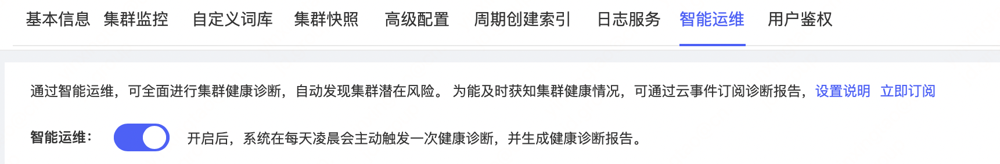
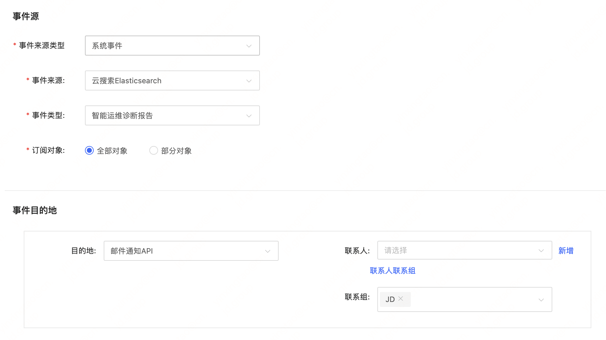

# 订阅健康诊断报告
## 前提条件
- 已开启 **智能运维** 服务，详情请参见 [开启智能运维服务](../HealthCheck/Health_check_on.md)
- 为能及时获知集群健康情况，可通过云事件订阅诊断报告。
## 操作步骤
1. 在ES控制台台的目标实例详情页，单击 ES集群-智能运维的 **立即订阅** 按钮跳转到事件服务，或登录事件服务控制台点击[新建事件订阅规则](https://events-console.jdcloud.com/event/create?type=create)。

   

2. 在新建事件订阅规则页面，完善信息。

   - 订阅规则名称：自定义名称，建议填写有意义易识别的名称。
   - 事件来源：
     - 事件来源类型：系统事件；
     - 事件来源：云搜索Elasticsearch；
     - 事件类型：智能运维诊断报告；
     - 订阅对象：可选择全部或者指定ES集群；
   - 事件目的地：
     - 可选择邮件通知、短信通知或者发送到事件消费kafka供订阅使用。

   

