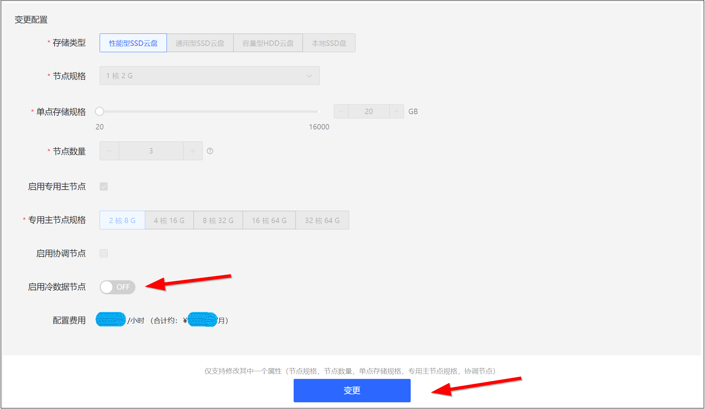

# 冷热数据分离

ELasticsearch主要用于海量数据的存储和检索，若将所有的数据都放在SSD硬盘上，成本会比较高。如果您的数据具有以下特点，可以通过冷热数据分离，冷热集群可以在一个集群内包含冷、热两种属性的节点，从而兼顾性能和容量之间的矛盾</br>
| 节点类型 | 数据存储要求 | 读写性能要求 | 规格要求 | 存储要求 |
| :------ |  :------ | :------ | :------ | :------ |
| 热节点（hot） | 查询频率高、写入压力大、对读写性能要求比较高的的索引（例如7天内的日志）。| 高 | 高，例如16核64GB | 建议使用性能型SSD云盘存储数据，存储空间大小需根据数据大小进行设置。|
| 冷节点（warm）| 对存储量需求比较大，但查询频率低基本无写入、对读写性能要求较低的索引（例如1个月甚至更长时间的日志）。| 低 | 低，例如8核32GB | 建议使用容量型HDD云盘或通用型SSD云盘存储数据，存储空间大小需根据数据大小进行设置。|

> 请根据您的实际需要选择磁盘类型，磁盘规格和性能可参考 [云盘实例规格](https://docs.jdcloud.com/cn/cloud-disk-service/instance-type)。
> 
京东云搜索Elasticsearch提供了快速配置构建冷热集群的能力，您可以在控制台启用冷数据节点，快速建立一个冷热分离架构的ES集群。</br>

## 创建冷热集群</br>
### 新建集群时直接创建</br>
1. 访问 [云搜索Elasticsearch 控制台](https://es-console.jdcloud.com/clusters)，或者访问 [京东云控制台](https://console.jdcloud.com/) 选择【云服务】-【互联网中间件】-【云搜索Elasticsearch】进入实例列表页 。</br>
2. 参考 [创建集群](../../../Getting-Started/Create-ES.md)，在页面中选择所需创建集群的相关信息。</br>
3. 在规格部分选择**启用冷数据节点**，并选择冷数据节点规格。</br>
4. 进一步设置集群的其他参数，确认创建冷热集群。</br>


</br></br>


### 将现有集群变更配置为冷热集群</br>
> 注意：现有集群变更配置为冷热集群时，集群将会滚动重启。请确保在变更配置前，集群的 **状态为正常（绿色）、索引至少包含1个副本、资源使用率不是很高**。
> - 查看索引副本：登录对应实例的 Kibana 控制台，执行 GET _cat/indices?v 命令，在返回结果中查看对应索引的 rep 值，≥1表示该索引至少包含一个副本。
> - 查看资源使用率：在集群监控页面查看，例如节点 CPU 使用率为80%左右，节点 HeapMemory 使用率为50%左右，节点负载低于当前数据节点的 CPU 核数。
1. 访问 [云搜索Elasticsearch 控制台](https://es-console.jdcloud.com/clusters)，或者访问 [京东云控制台](https://console.jdcloud.com/) 选择【云服务】-【互联网中间件】-【云搜索Elasticsearch】进入实例列表页。</br>
2. 在实例列表页，选择目标集群右侧的【操作-更多-变更配置】。</br>
3. 在变更配置页，选择**启用冷数据节点**，并选择冷数据节点规格。</br>
4. 点击变更并确认，等待集群配置变更完成。</br>


</br></br>

> 当您启用了冷数据节点并购买后，系统会在节点启动参数中加入-Enode.attr.box_type参数。
> - 热数据节点：-Enode.attr.box_type=hot
> - 冷数据节点：-Enode.attr.box_type=warm

</br>

## 使用冷热集群
登陆目标集群的Kibana控制台，在左侧导航栏，单击 **Dev Tools**。
### 节点角色查看
可以通过以下命令验证节点的冷热属性。
```
GET _cat/nodeattrs?v&h=node,attr,value&s=attr:desc

node            attr           value
node-0          box_type       hot
node-1          box_type       hot
node-2          box_type       hot
warmnode-0      box_type       warm
warmnode-1      box_type       warm
warmnode-2      box_type       warm
...
```

### 指定索引冷热属性
您可以根据实际情况决定索引的冷热属性。
- 对于热数据，设置索引配置如下：
```
PUT hot_data_index/_settings
{
        "index.routing.allocation.require.box_type": "hot"
}
```
- 对于冷数据，设置索引配置如下：
```
PUT warm_data_index/_settings
{
        "index.routing.allocation.require.box_type": "warm"
}
```
- 也可以去掉冷热数据配置，不受冷热数据标签影响：
```
PUT myindex/_settings
{
        "index.routing.allocation.require.box_type": null
}
```

### 通过索引模板创建冷热索引
通过设置template，可以通过索引模板将相应的索引存储到指定的冷热数据节点。如下所示，可以在Kibana中，通过模板在创建的时候把 warm_data_index* 的索引，存储在冷数据节点上。
- **5.x版本**，可使用以下命令创建索引模板：
```
PUT _template/test
{
    "order": 1,
    "template": "warm_data_index*",
    "settings": {
        "index": {
            "refresh_interval": "30s",
            "number_of_shards": "3",
            "number_of_replicas": "1",
            "routing.allocation.require.box_type": "warm"
        }
    }
}
```

- **6.x及以上版本**，可使用以下命令创建索引模板：
```
PUT _template/test
{
    "order": 1,
    "index_patterns": "warm_data_index*",
    "settings": {
        "index": {
            "refresh_interval": "30s",
            "number_of_shards": "3",
            "number_of_replicas": "1",
            "routing.allocation.require.box_type": "warm"
        }
    }
}
```

### 验证设置的索引
1. 创建测试索引
```
PUT hot_warm_test_index
{
    "settings": {
        "number_of_replicas": 1,
        "number_of_shards": 3
    }
}
```
2. 查看分片分配，可以看到分片均匀分配在热节点上。
```
GET _cat/shards/hot_warm_test_index?v&h=index,shard,prirep,node&s=node

index               shard prirep node
hot_warm_test_index 2     p      node-0
hot_warm_test_index 1     r      node-0
hot_warm_test_index 2     r      node-1
hot_warm_test_index 0     p      node-1
hot_warm_test_index 1     p      node-2
hot_warm_test_index 0     r      node-2
```
3. 设置测试索引为冷索引。
```
PUT hot_warm_test_index/_settings
{
    "index.routing.allocation.require.box_type": "warm"
}
```
查看分片分配，分片均分配到冷节点上。</br>
```
GET _cat/shards/hot_warm_test_index?v&h=index,shard,prirep,node&s=node

index               shard prirep   node
hot_warm_test_index   1     p      warmnode-0
hot_warm_test_index   0     r      warmnode-0
hot_warm_test_index   2     r      warmnode-1
hot_warm_test_index   0     p      warmnode-1
hot_warm_test_index   2     p      warmnode-2
hot_warm_test_index   1     r      warmnode-2
```

## 关闭冷数据节点
### 前置条件
1. 设置全部索引为热索引。
2. 没有分片分配在冷节点上。

### 设置全部索引为热索引
修改全部冷索引的索引配置，把冷索引修改为热索引。系统将会把修改的索引的分片迁移至热节点上。
```
PUT <#hot_data_index#>/_settings
{
        "index.routing.allocation.require.box_type": "hot"
}
```

### 检查没有分片分配在冷数据节点上
查看分片分配，检查是否所有的分片都分配到热节点上了。
检查方法为：检查“shards”列，确认所有冷节点（warmnode-*）的节点上的分片数（shards）为0。
```
GET _cat/allocation?v&s=node

shards disk.indices disk.used disk.avail disk.total disk.percent host         ip           node
    56       48.8kb    34.3mb     29.9gb     29.9gb            0 10.123.32.22 10.123.32.22 node-0
    56        4.9mb    39.3mb     29.9gb     29.9gb            0 10.123.32.23 10.123.32.23 node-1
    56        4.9mb    39.3mb     29.9gb     29.9gb            0 10.123.32.24 10.123.32.24 node-2
    56       48.8kb    33.9mb     29.9gb     29.9gb            0 10.123.32.25 10.123.32.25 node-3
     0           0b    32.4mb     19.9gb     19.9gb            0 10.123.34.4  10.123.34.4  warmnode-0
     0           0b    32.4mb     19.9gb     19.9gb            0 10.123.34.5  10.123.34.5  warmnode-1
     0           0b    32.4mb     19.9gb     19.9gb            0 10.123.34.6  10.123.34.6  warmnode-2
```

如果冷节点上还有分片，查询结果类似如下，存在某个或多个冷节点（warmnode-*）的节点上的分片数（shards）不为0
```
shards disk.indices disk.used disk.avail disk.total disk.percent host         ip           node
    54       48.4kb    34.1mb     29.9gb     29.9gb            0 10.123.32.22 10.123.32.22 node-0
    54        4.9mb    39.3mb     29.9gb     29.9gb            0 10.123.32.23 10.123.32.23 node-1
    54        4.9mb    39.3mb     29.9gb     29.9gb            0 10.123.32.24 10.123.32.24 node-2
    54       48.4kb    33.8mb     29.9gb     29.9gb            0 10.123.32.25 10.123.32.25 node-3
     2         416b    32.4mb     19.9gb     19.9gb            0 10.123.34.4  10.123.34.4  warmnode-0
     3         624b    32.4mb     19.9gb     19.9gb            0 10.123.34.5  10.123.34.5  warmnode-1
     3         624b    32.4mb     19.9gb     19.9gb            0 10.123.34.6  10.123.34.6  warmnode-2
```

### 关闭冷数据节点
1. 访问 [云搜索Elasticsearch 控制台](https://es-console.jdcloud.com/clusters)，或者访问 [京东云控制台](https://console.jdcloud.com/) 选择【云服务】-【互联网中间件】-【云搜索Elasticsearch】进入实例列表页。</br>
2. 在实例列表页，选择目标集群右侧的【操作-更多-变更配置】。</br>
3. 在变更配置页，如果关闭冷数据节点的前提条件全部满足，启用冷数据节点开关将处于可关闭状态；否则，启用冷数据节点开关将置灰为不可关闭状态。


4. 点击关闭**启用冷数据节点**开关。</br>
5. 点击变更并确认，等待集群配置变更完成。</br>



</br></br>

