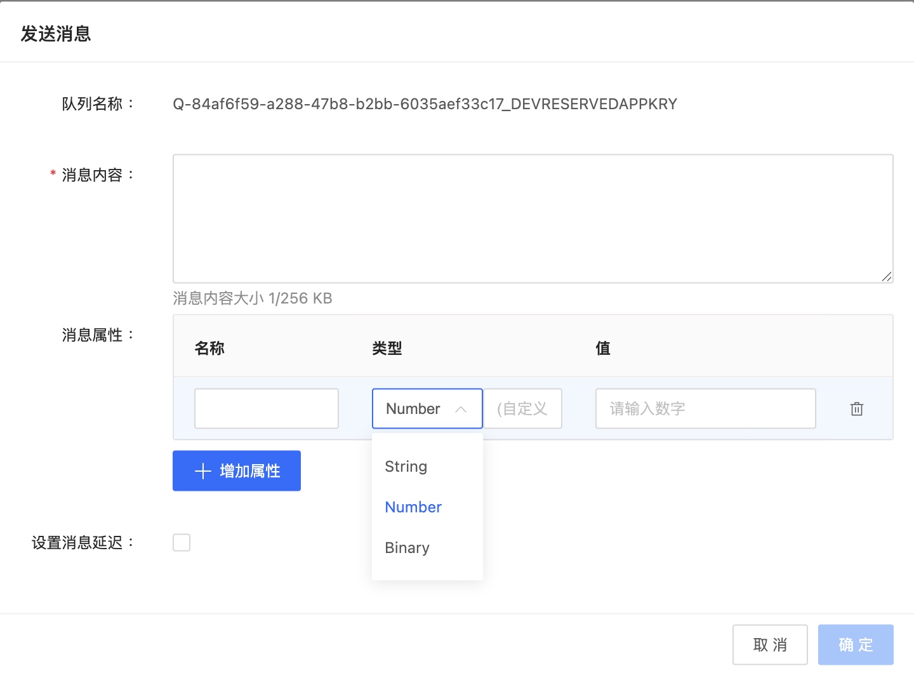

# 发送消息

1. 在队列管理页面中，找到想要发送消息的队列，在操作中选择“发送消息”。

2. 对于标准队列的消息发送，可以为消息增加消息属性，还设置发送延时消息延迟时间。

   标准队列-发送消息：

   

   - 消息内容：内容大小是根据队列属性中消息的最大长度来限定的
   - 消息属性：
     - 消息属性名称：
       1. 可以包含以下字符：A-Z、a-z、0-9、下划线 (_)、连字符 (-) 和句点 (.)
       2. 最长可为 256 个字符
       3. 必须在消息的所有属性名中唯一
       4. 不能以句点开头或结尾
       5. 序列中不能有连续句点
     -  消息属性类型：支持的类型包括 String、Number 和 Binary，后面一个自定义输入框支持添加自定义的附加类型，例如float,int。则属性变为Number.float，Number.int
     - 消息属性值：根据消息属性类型的选择，需要输入不同类型的值
     - 消息属性的所有内容都包括在消息大小限制中
   - 设置延迟时间：0-15分钟，单位为秒，设置后覆盖队列中的投递延迟

