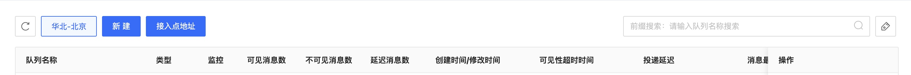
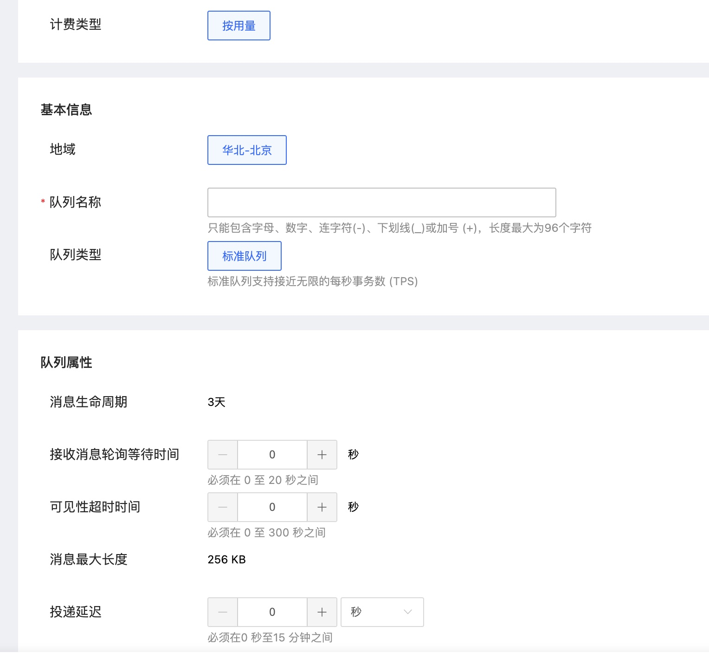

# 创建队列

1. 选择想要创建资源的区域，然后点击“新建”按钮，新建队列。

   

2. 新建队列中需要填写“队列名称”，只能包含字母、数字、连字符(-)、下划线(_)或加号 (+)，长度最大为80字符。
   

3. 根据自身需求填写队列属性。

   - 消息生命周期：3天，消息在本队列中最长的存活时间
   - 接收消息轮询等待时间：0-20秒，单位为秒，请求未取到消息响应等待时间
   - 可见性超时时间：0-300秒，单位为秒，接收的消息对于其他接收者不可见的时间
   - 消息最大长度：256KB，单位为KB，消息队列所接收的最大的消息大小
   - 投递延迟：0-15分钟，单位为秒，消息被投递到队列里的延迟时间
   -   基于消息内容的去重（FIFO队列特有属性）：FIFO队列是否需要基于消息内容去重

4. 然后点击新建队列完成创建
