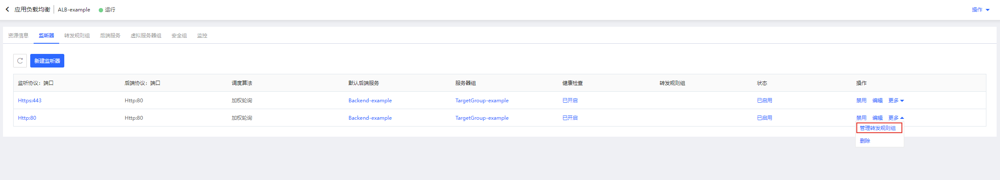

# 使用 ALB 将 HTTP 请求重定向至 HTTPS 请求

## 使用场景

- HTTPS是一种加密数据传输协议，相较于HTTP协议其安全性更高。用户发起对某个域名（如 www.example.com 的 HTTP 请求，可以通过 ALB 重定向至 HTTPS 请求，从而实现 HTTPS 安全改造。

## 准备与规划

- 网络准备

	根据业务部署需要，提前规划应用负载均衡和作为后端服务器的云主机、容器的地域、可用区、私有网络等。
	
	注意：作为后端服务器的云主机、容器需要与应用负载均衡同一地域、私有网络。

- 服务器准备

	需提前创建承载业务流量的云主机、容器，并确保打开监听所需的端口，合理配置安全组、ACL策略。

- 应用负载均衡实例

	创建一个应用负载均衡实例，并设置地域、可用区、网络、安全组等配置。

## 创建一个HTTP监听器

- 前端监听配置：
	
	点击 **新建监听器** 创建一个监听器：选择HTTP协议，配置监听端口、空闲连接超时。

	

- 后端转发配置：可以新建或者选择已有的后端服务，注意只能选择后端协议为HTTP类型的后端服务。
	
	这里新建一个后端服务：配置后端服务名称、协议（HTTP）、端口为80、调度算法选择加权轮询、开启会话保持、配置会话保持超时时间、开启获取真实IP，配置获取HTTP头字段。

	

- 配置健康检查：设置健康检查相关参数，这里使用HTTP方式。

	

- 添加服务器组：根据业务需要选择虚拟服务器组、高可用组。如没有可用的虚拟服务器组，点击**新建虚拟服务器组**创建一个新的虚拟服务器组，可选云主机、容器，定义实例的端口、权重。

  注：只能选择与应用负载均衡同私有网络下的云主机、容器资源。

  

  创建完毕后选择该虚拟服务器组

  

- 至此，已创建完成基于 HTTP 协议的监听器，可在监听器列表查看。

	

## 创建一个HTTPS监听器

- 前端监听配置：

  点击**新建监听器**创建一个监听器：选择 HTTPS 协议，配置监听端口、根据您的业务选择合适的 SSL 证书、选择空闲连接超时。

- 后端转发配置：可以新建或者选择已有的后端服务，注意只能选择后端协议为 HTTP 类型的后端服务。

  此处选择上一步创建的后端服务，其健康检查和服务器组在上一步创建中已经完成配置。

- 至此，已创建完成基于 HTTPS 协议的监听器，可在监听器列表查看。

## 创建一个转发规则组

- 通过应用负载均衡-详情-转发规则组进入转发规则组列表页。

- 点击**新建转发规则组**，打开转发规则组创建页，填写转发规则组名称和描述。

  

3. 点击**添加规则**，为转发规则组配置转发规则。
    - 域名：用于匹配客户端请求的域名。支持输入IPv4地址和域名，域名支持精确匹配和通配符匹配，输入限制如下：
      - 仅支持输入大小写字母、数字、英文中划线“-”和点“.”，不区分大小写，且不能超过110字符。
      - 最少包括一个点"."，不能以点"."和中划线"-"开头或结尾，中划线"-"前后不能为点"."。
      - 通配符匹配支持包括一个星"*"，输入格式为\*.XXX或XXX.\*。
    - URL路径：用于匹配客户端请求的URL路径，支持精确匹配和前缀匹配。
      - 必须以/开头。
      - 仅支持输入大小写字母、数字和特殊字符：$-_.+!'()%:@&=/，区分大小写，且不能超过128字符。
      - 前缀匹配支持包括一个星"*"，输入格式为/XXX\*或/\*。
    - 动作：选择重定向，将访问请求重定向到指定URL地址，可配置重定向的以下参数：
      - 重定向后协议：取值为HTTP、HTTPS，缺省值为#{protocol}，缺省值表示重定向后不修改请求协议，与客户端请求协议一致
      - 重定向后端口：取值为1~65535，缺省值为#{port}，缺省值表示重定向后不修改请求端口号，与客户端请求端口号保持一致
      - 重定向后域名：支持输入IPv4地址和域名。域名输入限制为仅支持输入大小写字母、数字、英文中划线“-”和点“.”，最少包括一个点"."，不能以点"."和中划线"-"开头或结尾，中划线"-"前后不能为点"."，不区分大小写，且不能超过110字符。缺省值为#{domain},缺省值表示重定向后不修改请求域名，与客户端请求域名保持一致。
      - 重定向后URL路径：必须以/开头，仅支持输入大小写字母、数字和特殊字符-_.+!'()%:@&=/，区分大小写，且不能超过128字符。缺省值为#{path}，缺省值表示重定向后不修改请求URL地址，与客户端请求URL路径保持一致。
      - 重定向后查询参数：最长128个字符，支持除空格和#[ ]{}|<>$ ;外的可见字符。不需手动输入?，系统默认添加。缺省值为#{query}，缺省值表示重定向后不修改请求的查询参数，与客户端请求查询参数保持一致。
      - 重定向方式：取值包括301、302、307、308。
      - 重定向动作类型的规则支持配置如下扩展动作：
        - 写入Header（响应）：负载均衡将重定向请求转发给客户端时，支持写入指定Header。
    - 此处将域名设置为 www.example.com ，URL路径设置为/\*，选择动作类型为重定向，修改重定向协议为HTTPS、修改重定向端口为443，不修改重定向后域名、URL路径查询参数，重定向方式取值为301。
    
    

- 至此，已创建完成一个转发规则组，该转发规则组将对 www.example.com 发起的 HTTP 请求重定向至 HTTPS 请求。

## 将转发规则组关联至HTTP监听器

- 在监听器列表页，选择对应的监听器，在操作中选择**更多-管理转发规则组**

  

- 将刚创建的转发规则组关联至 HTTP 监听器上

  

- 至此，已经将该转发规则组关联至 HTTP 监听上。该 HTTP 监听将会根据转发规则组中的规则，将对域名 www.example.com 发起的HTTP请求重定向至 HTTPS 请求。同时，HTTPS监听器保证了该请求能够转发给相应的后端服务。

  

