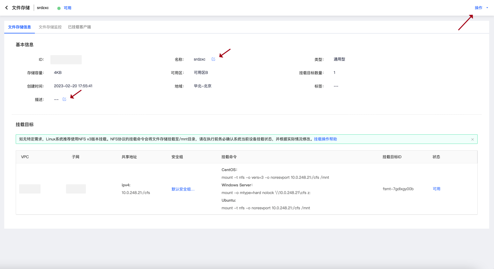
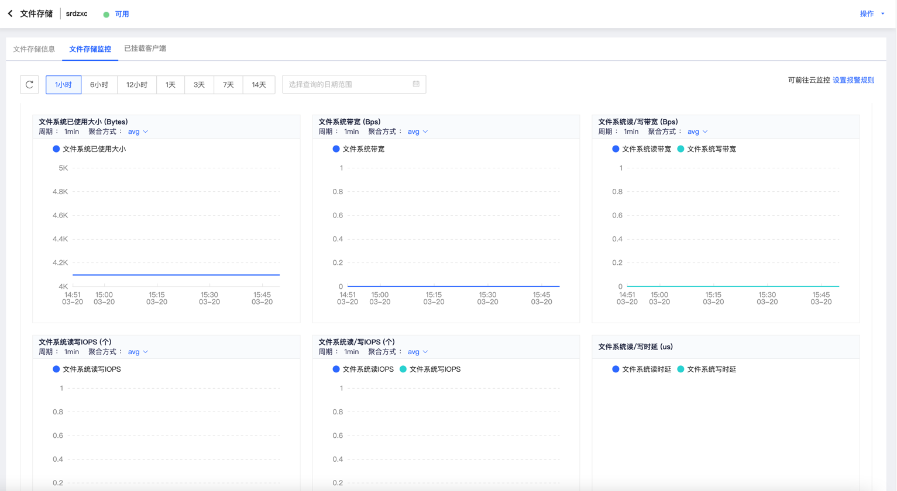

# 文件存储详情

  &#8195;&#8195;您可以在文件存储列表内，点击任意文件存储的“ID”进入该文件存储的详情信息页面。
  
    

## 查看文件存储详情信息
  
  &#8195;&#8195;当您点击进入文件系统详情信息页面时，您可以在在“文件存储信息”TAB页中的**基本信息**中查看该文件系统的“ID”、“名称”、“类型”、“存储容量”、“可用区”、“挂载目标数量”、“创建时间”、“地域”、“标签”和“描述”信息。
  
  &#8195;&#8195;其中，您可以通过点击“名称”和“描述”右侧的编辑按钮，对该文件存储的名称或描述进行编辑，编辑完成后点击弹出框的“确定”按钮即可保存。

## 查看挂载目标

  &#8195;&#8195;当您点击进入文件系统详情信息页面时，您可以在“文件存储信息”TAB页中的**挂载目标**中查看挂载目标的“VPC”、“子网”、“共享地址”、“安全组”、“挂载命令”、“挂载目标ID”和“状态信息”。

## 详情页面操作

  &#8195;&#8195;您可以点击详情信息页面右上角的“操作”按钮，可以通过点击“管理挂载目标”、“编辑标签”、“删除”按钮使用相应的功能。

## 文件存储监控

  &#8195;&#8195;当您点击进入文件系统详情信息页面时，您可以在“文件存储监控”TAB页中自定义时间长度查看“文件系统已使用大小”、“文件系统带宽”、“文件系统读/写带宽”、“文件系统读写IOPS”、“文件系统读/写IOPS”和“文件系统读/写时延”信息。同时可以通过点击该TAB右上角的“设置报警规则”按钮前往云监控设置报警规则。
  
    

## 查看已挂载客户端
&#8195;&#8195;当您点击进入文件系统详情信息页面时，您可以在“已挂载客户端”TAB页中查看已挂载的客户端列表。

<table><tr><td>注意：列表仅显示近一分钟内使用过或正在使用的客户端IP，部分已挂载但近期没有使用的客户端可能不被展示</td></tr></table>

