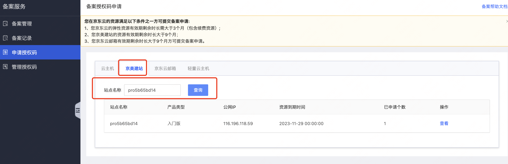
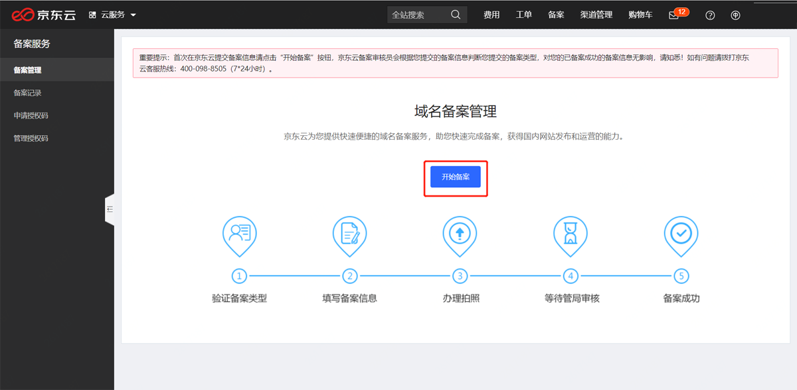

### 网站备案  

根据工信部《互联网信息服务管理办法》(国务院292号令)和工信部令第33号《非经营性互联网信息服务备案管理办法》规定，未取得许可或者未履行备案手续的网站不能开通访问。因此，为了保证网站能够正常访问，需要在注册域名以及搭建网站后，及时提交网站备案。    

域名备案原则是您的服务器资源在哪里就需要在哪里备案。购买京美建站后，需要在京东云备案。如果您的域名已经在第三方备案过，当前需要把此域名绑定到京美建站，依然要在京东云备案。
  
京东云提供[备案服务](https://record-console.jdcloud.com/list)，助力您便捷完成备案。

购买正式的建站服务1年及以上的版本提供授权码，如果您是试用版，请升级版本后获取授权码。一个站点只提供一个授权码。

1.申请备案授权码
使用京美建站的站点名称，在备案服务[申请授权码](https://record-console.jdcloud.com/authcode/apply).

2.进行备案操作，操作指引见 [备案操作说明](https://docs.jdcloud.com/cn/icp-license-service/introduction)

